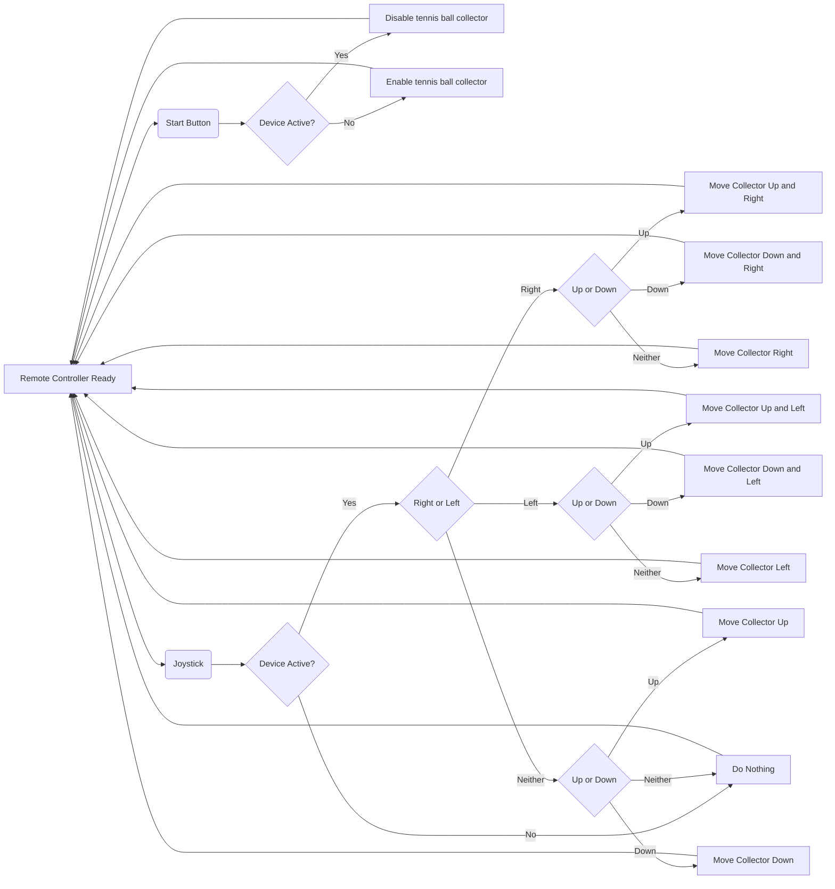

# Introduction 

  Tennis is a time-honored game that can be dated back to the 11th century, played by all ages all around the world. When you think of tennis you think of the intense competition, the player’s personalities, and the feeling in the of your favorite team winning. What is not talked about however is the cleanup process, after an intense match there is a lot of preparation that goes into getting the next match ready. When consulting the customer, they explained that their current tennis ball collecting method was outdated and broken. The main objective of this Capstone Design is to make improvements to the current Tennis Ball Collector by adding remote control capability and an accurate ball counter to help make the cleanup process more effective. 

# Restating the Fully Formulated Problem 

  

  The fully formulated problem is the overall objective and scope complete with the set of shall statements. This was part of the project proposal. However, it may be that the scope has changed. So, state the fully formulated problem in the introduction of the conceptual design and planning document. For each of the constraints, explain the origin of the constraint (customer specification, standards, ethical concern, broader implication concern, etc.). 

The updated machine of our project: 
 
 - Shall be remote control operated 

   * Customer wants easier mobility of device 

 - Shall include a counting device that is sensor operated 

 - Shall include a charging port for powering the electronics within the system 

 - Shall include motors for controlling the wheels of the system 

 - Shall include a tennis ball anti-jamming system 

 - Shall collect and manage up to 100 balls at a time 

 - Shall be cost-efficient, no more than 33% more than customer’s alternative option 

   * Playmaker's Manual Ball Mower valued at $595 

   * Tennibot Rover Autonomous Tennis Assistant [Collector] valued at $2995 

 - Shall comply with 49 CFR 173.185 to prevent short-circuits damage 

 - Shall comply with the U.S. Hazardous Materials Regulations for dry cell batteries 

 - Shall comply with FCC part 15 under the classification of an unintentional radiator 

  

# Comparative Analysis of Potential Solutions 

 A potential solution for the issue of balls jamming the collector would be to add vibration motors near the collector that would ensure the balls are always moving and not able to get caught in one spot. To solve the problem of users tiring out after pushing the cart around we will add remote control capabilities to the tennis ball collector. To address the problem of device cost we are making the tennis all collector remote controlled rather than autonomous. 

When Team 3 began developing solutions for the tennis ball collector, they first had to address the problems at hand. Said issues were mobility, jamming, data, and funding. The thought process of the Team is as follows: 

  To fix the customer’s issue with the machine’s mobility there were a few solutions proposed. They were to leave the machine manual, make it autonomous, or make it remote controlled. If the machine were to be left manual, the problem would still be present since players would have to push around the machine at the end of the practice. This would be of no benefit to the customer since they would be in the same situation they were in before this project with a time-consuming task at the end of the day. As far as autonomy goes, this solution would be very effective for the team, however, the process of converting the machine into an autonomous one would be a great challenge. In a discussion with an advisor the team was informed of the difficulty of creating an autonomous device because of the complexity it would hold. In result of these deliberations, the team decided to make the machine remote control operated. This option allows the team to be faced with a challenge in the design process while being able to accomplish the customer's need for easier mobility. 

  For the machine jamming issue, two solutions were considered. The first was adding a vacuum mechanism to collect the tennis balls. This in theory sounds like a viable solution, however the implementation of said solution is where issues would be faced. Where will the tube run to? Where will a motor attach? How will the vacuum be powered on and off? All of these questions were considered when discussing how to fix the jamming, and the decision was made to not implement a vacuum. Instead, the proposition of a vibration mechanic was selected. Vibrating the device at the collector will provide enough movement to get tennis balls that are stuck where they are intended while not requiring multiple additions. This solution can be implemented with a simple vibrating motor that will be isolated in one area and won’t require a lot of power in comparison to a vacuum motor.  

  “Have all the balls been collected for the day?” is a question that shouldn’t have to be asked. If the customer uses a select amount of tennis balls at practice, they should have a mechanic to keep count of how many they have collected so far. The proposed solution to this was to implement a counter device in the form of a seven-segment display that works in tandem with sensor. This solution proved to be viable since the addition of a photoelectric sensor and seven segments both provide a challenge to the team while being budget friendly. 

  Finally, the most crucial aspect of the whole project is the funding  

The problems: 

 - Mobility 

   * Manual –Heavy, Time-Consuming 

   * Autonomous –Productive, Challenging 

   * Remote Control—Semi-Productive, Achievable in Time Constraint 

 - Jamming 

   * Vaccuum Collection—Efficiency Improvement, Lessen Completion Time 

   * Vibration Mechanic—Solution to Current Customer Errors 

 - Data 

   * Sensor Detection –Counter, Active Time Factor 

   * Loss Potential—Notification for Missing Balls 

 - Funding 

   * Price of Tennibot –Very Expensive, impractical 

   * Price of New Playmate –Reasonable, Low Feature 

# High-Level Solution 

  

  This section presents a comprehensive, high-level solution aimed at efficiently fulfilling all specified requirements and constraints. The solution is designed to maximize stakeholder goal attainment, adhere to established constraints, minimize risks, and optimize resource utilization. Please elaborate on how your design accomplishes these objectives. 

 

What we plan to add: 

 - Vibrating motors to help with jamming of Tennis Balls 

 - Counter for general improvement on cleanup count 

 - RC motors for RC Control 

  

# Hardware Block Diagram 

MERMAID CODE HERE
  

# Operational Flow Chart 

# Atomic Subsystem Specifications 

  Based on the high-level design, provide a comprehensive description of the functions each subsection will perform. 

## Subsystems 

### RC receiver and transmitter / Motors Systems 

 - Signal Type: Wireless Communication, Power Signal 

 - Signal Direction: Input for Transmitter / Output for Receiver and RC Motors 

 - Communication Protocols: PPM for Receiver 

 - Expectation: What shall be used is a simple Transmitter and Receiver to control the motors rotation for RC control  

### Counting Sensors Systems 

 - Signal Type: Serial Communication 

 - Signal Direction: Input for Sensors / Output for Seven Segments 

 - Communication Protocols: BCD 

 - Expectation: While the entire system runs, this sensor system shall detect and keep track of the counted and collected balls.  

### Vibration Systems 

 - Signal Type: Power Signal 

 - Signal Direction: Output 

 - Communication Protocols: PWM motor 

 - Expectation: While the Entire system is running the vibration system shall also run and help with disrupting the collection of balls 

 

## Flowchart

  For all subsystems, formulate detailed "shall" statements. Ensure these statements are comprehensive enough so that an engineer who is unfamiliar with your project can design the subsystem based on your specifications. Assume the role of the customer in this context to provide clear and precise requirements. 

  

  

# Ethical, Professional, and Standards Considerations 

## IEEE 

 - IEEE 802.15.4 (Low-rate wireless personal area networks, useful for RC communications) 

 - IEEE 1451 (Standards for smart transducers, relevant for sensor integration with servos) 

## ISO 

 - ISO 25119 (Safety for control systems in machinery, including RC and servo-driven systems) 

 - ISO 10303 (Automation systems and integration, relevant for computer-controlled RC systems) 

## IEC 

 - IEC 60034 (Standards for electric motors, which includes servo motors) 

 - IEC 60730 (Automatic electrical controls, important for automated RC and servo systems) 

 

## SAE International (Society of Automotive Engineers) 

 - SAE AS-5684 (Control system servomechanisms) 

 - SAE J1939 (Communication protocols in vehicles, which may be used in advanced RC systems) 

 - FCC (Federal Communications Commission) 

 - FCC Part 15 (Regulates unlicensed radio-frequency devices, including RC transmitters and receivers) 

 - FCC Part 97 (Amateur radio service, for RC enthusiasts using specialized frequencies) 

 

   If we add specifications/constraints based on the standards we read, address the reason we considered to add them 

 

# Resources 
 

  The project requires hardware and software resources to create and efficient, portable, and cost-effective remote-controlled tennis ball collector. Key hardware includes the RC transmitter, receiver, Arduino UNO R4, battery, LCD display, vibration motor, servos, wheels, and sensors such as the photelectric sensor for ball detection. Additionally, lab equipment like oscilloscopes and computers for interfacing with the processor will be necessary for testing. The components for prototyping are relatively inexpensive, and the total estimated cost for prototyping is $1,000.  

  The software resources include CAD software for designing the final version of the collector. Additionally, developmental environments for programming Arduino and any RF control system testing will be essential. The software resources will be used to design, simulate, and test the functionality of the tennis ball collector.  

# Budget 

  Develop a budget proposal with justifications for expenses associated with each subsystem. Note that the total of this budget proposal can also serve as a specification for each subsystem. After creating the budgets for individual subsystems, merge them to create a comprehensive budget for the entire solution. 

 

  The budget proposal covers the key subsystems of the tennis ball collector, with a total of $2,000 for the entire project: 

## CAD Software ($300 - $500) 

## Prototyping ($431.9- $596.9): 

| Part name | Cost |
| ---------- | --------- |
| RC transmitter | 50-100 |
|  RC receiver | 50-100 |
| Arduino UNO R4 | 30 |
| battery | 30-50 |
| Charger | 30-70 |
| LCD display | 10 |
| Vibration motor | 5-10 |
| Wheels | 50 |
| Servos | 100 |
| Diffused Beam Photoelectric Sensor | 76.90 |

 

# Skills 

  

  First, conduct a thorough analysis of the skills currently available within the team, and then compare these skills to the specific requirements of each subsystem. Based on this analysis, assign each team member to oversee the development of a particular subsystem. Additionally, appoint a different team member to take the specifications and generate a corresponding solution. Ensure that the assignments are structured in such a way that no single team member is simultaneously managing and being managed by the same person. If there are more team members than subsystems, consider further subdividing the solutions into smaller tasks or components, thereby allowing each team member the opportunity to manage and design a subsystem. 

Ashli: 

Carter: Experience with RC cars, servos, vibration motors, programing, microcomputers, FPGAs 

Cindy: Experienced with object-oriented programming, a little RANCS autonomous vehicle programming, microcomputing, and digital systems. 

Gabriel: 

Maxwell: 

Tate: 
 

  

# Timeline 

  

# References 
[1] “Ball Mower 2.0,” PLAYMATE Tennis, https://www.playmatetennis.com/ball-mower-2/ (accessed Oct. 7, 2024). 

[2] “Tennibot ,” Tennibot, https://www.tennibot.com/buy/ (accessed Oct. 7, 2024). 

[3] “Arduino® Uno R4 WIFI,” Arduino Official Store, https://store.arduino.cc/products/uno-r4-wifi (accessed Oct. 7, 2024). 

[4] “5035,” DigiKey Electronics, https://www.digikey.com/en/products/detail/adafruit-industries-llc/5035/14625568?s=N4IgjCBcoMw1oDGUBmBDANgZwKYBoQB7KAbRAHYYxyAGEAXQIAcAXKEAZRYCcBLAOwDmIAL4EALGABMCEMkjps%2BIqRAwAbAFYqmhszaROPAcJFiQMyGQy8WAC14BXALYACXoX4MRQA (accessed Oct. 7, 2024). 

[5] DigiKey - electronic components distributor, https://www.digikey.com/ (accessed Oct. 7, 2024). 

[6] “DigiKey Home,” DigiKey, https://www.digikey.com/ (accessed Oct. 7, 2024). 

[7] “EA DOGM132L-5,” DigiKey Electronics, https://www.digikey.com/en/products/detail/display-visions/EA-DOGM132L-5/4896710 (accessed Oct. 7, 2024). 

[8] “VZ4KC1B1051202,” DigiKey Electronics, https://www.digikey.com/en/products/detail/vybronics-inc/VZ4KC1B1051202/6009917 (accessed Oct. 7, 2024). 

[9] “125mm all-terrain robotics wheel set,” Studica, https://www.studica.com/studica-robotics-brand/125mm-all-terrain-wheel-set (accessed Oct. 7, 2024). 

[10] “Servos 1142,” DigiKey Electronics, https://www.digikey.com/en/products/detail/adafruit-industries-llc/1142/5154658 (accessed Oct. 7, 2024). 

[11] “Photo sensors - diffuse,” Stack, https://stack-light.com/products/diffuse-photo-sensors?variant=44817176461531&currency=USD&gad_source=1&gclid=Cj0KCQjwjY64BhCaARIsAIfc7YZnyGzIxWyyUjUTWbqxsLxM_eVRJhUGIMK7RvBAOAtBdTkI59_Xu8YaAmwzEALw_wcB (accessed Oct. 7, 2024). 

 

  

# Statement of Contributions 

  

Tate Finley – Fully Formulated Problem (shall statements), hardware block diagram 

Cindy Escobar – Resources, Budget, References  

Gabriel Dubose – High Level Solutions, comparative solutions, introductions 

Carter Brady – Comparative analysis of potential solutions, Operational flow chart, Ethical, Professional, and standards considerations 

Ashli Watkins – Ethics, Professional, and Standards Considerations section 

Maxwell Wynne – fully formulated problem, comparative analysis of potential solutions 

 
