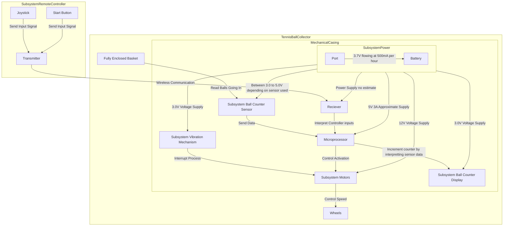
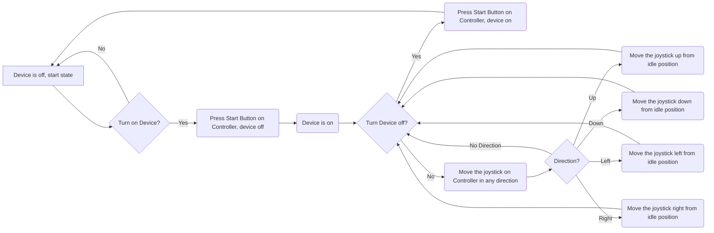

# Introduction 

  Tennis is a time-honored game that can be dated back to the 11th century, played by all ages all around the world. When you think of tennis you think of the intense competition, the player’s personalities, and the feeling of your favorite team winning. What is not talked about however is the cleanup process, after an intense match there is a lot of preparation that goes into getting the next match ready. When consulting the customer, they explained that their current tennis ball collecting method was outdated and broken. The current model is operated by manually pushing the machine, this sometimes caused balls to jam inside the machine from not pushing hard enough. The main objective of this Capstone Design is to make improvements to the current Tennis Ball Collector by adding remote control capability and an accurate ball counter to help make the cleanup process more effective.  

# Restating the Fully Formulated Problem 


The updated machine of our project: 
 
 - Shall be remote control operated using an Raspberry Pi

   * Customer wants easier mobility of device 

 - Shall include a counting device that is sensor operated 

 - Shall include a charging port for powering the electronics within the system 

 - Shall include motors for controlling the wheels of the system

 - Shall include a tennis ball anti-jamming system 

 - Shall collect and manage up to 100 balls at a time 

 - Shall be cost-efficient compared to other high priced competitors such as the Tennibot [1]

 - Shall implement the use of a remote controller to operate the machine as an alternative to a new machine such as Playmaker [2]

 - Shall comply with 49 CFR 173.185 to prevent short-circuits damage 

 - Shall comply with the U.S. Hazardous Materials Regulations for dry cell batteries 

 - Shall comply with FCC part 15 under the classification of an unintentional radiator 

  

# Comparative Analysis of Potential Solutions 

The current device used by the Tennessee Tech Tennis team is the Playmate Ball Mower. The machine has an enlarged rolling pin attached to the wheels inside a metal casing that when moved, takes the balls from the ground around to the top into a collection basket. So, in order for the machine to operate as intended, it must be in motion at a speed high enough to transport the balls through the casing into the basket. When consulting the customer on the operation of said machine, some issues pointed out were the mobility, jamming of the device, keeping count of the balls used, and funding. The team addressed the problems as follows: 

To fix the customer’s issue with the machine’s mobility there were a few solutions proposed. They were to leave the machine manual, make it autonomous, or make it remote controlled. If the machine were to be left manual, the problem would still be present since players would have to push around the machine at the end of the practice. This would be of no benefit to the customer since they would be in the same situation they were in before this project with a time-consuming task at the end of the day. As far as autonomy goes, this solution would be very effective for the team, however, the process of converting the machine into an autonomous one would be a great challenge. In a discussion with an advisor the team was informed of the difficulty of creating an autonomous device because of the complexity it would hold. These complexities include sensory issues , implementation of Artificial Intelligence, and time constraints.  In result of these deliberations, the team decided to make the machine remote control operated. This option allows the team to be faced with a challenge in the design process while being able to accomplish the customer's need for easier mobility. 

|Mobility Solutions|Pros|Cons|
|----|----|----|
|Manual|Low cost, simple implementation |Leaves customer with no change to current issue |
|Autonomous|Self-operated, efficient  |Complexity (sensory issues, implementation of AI, time constraints), cost |
|Remote Controlled|Increased mobility, reasonable pricing, achievable in time constraint |User operated, range may pose an issue, remote must be powered |

For the machine jamming issue, two solutions were considered. The first was adding a vacuum mechanism to collect the tennis balls. This in theory sounds like a viable solution, however the implementation of said solution is where issues would be faced. Where will the tube run to? Where will a motor attach? How will the vacuum be powered on and off? All of these questions were considered when discussing how to fix the jamming, and the decision was made to not implement a vacuum. Instead, the proposition of a vibration mechanic was selected. Vibrating the device at the collector will provide enough movement to get tennis balls that are stuck where they are intended while not requiring multiple additions. This solution can be implemented with a simple vibrating motor that will be isolated in one area and won’t require a lot of power in comparison to a vacuum motor.  

|Jamming Solutions|Pros|Cons|
|----|----|----|
|Vacuum|Quick collection, efficiently stops jamming |Installing on current device, power |
|Vibration Device|Provides movement to stop jamming, simple implementation, low power |Vibration strength |

“Have all the balls been collected for the day?” is a question that shouldn’t have to be asked. If the customer uses a select amount of tennis balls at practice, they should have a mechanic to keep count of how many they have collected so far. The proposed solution to this was to implement a counter device in the form of a seven-segment display that works in tandem with sensor. This solution proved to be viable since the addition of a photoelectric sensor and seven segments both provide a challenge to the team while being budget friendly. 

|Count Solutions|Pros|Cons|
|----|----|----|
|Counter|Keeps accurate count, simple implementation, low cost |Seven segment has exposed design |

Finally, the most crucial aspect of the whole project is the funding. New collection devices are already out on the market, but unfortunately for the customer the funding for said devices isn’t there. A device called the Tennibot, that is a fully automated collector that functions similar to a Roomba but for a tennis court, is available but is marketed at a hefty price of $2,995. This is well out of the customer's budget, making it an unrealistic solution. On the cheaper side of the market is the purchase of a new Playmate collector, listed at $595. Although this is immensely cheaper than the Tennibot, over time the same issues happening now will repeat itself. So, Team 3 chose to improve the current machine by implementing the above features to give the customer a machine with similar functionality to the Tennibot plus more at a much lower price. 

|Funding Solutions|Pros|Cons|
|----|----|----|
|Tennibot |Fully autonomous, efficient |Costly, impractical |
|New Playmate |Cost effective |Same device will eventually have same issue,  |
|Team 3 additions |Increased mobility, counting mechanism, anti-jamming, cheaper than Tennibot |More expensive than a new playmate, takes time to develop |


# High-Level Solution 

 

What we plan to implement: 

 - Installing a Raspberry Pi on the base of the collector to control the hardware and software of the system.
   
 - Vibration motors shall be installed into the collector section of the Tennis Ball collector to help with jamming of Tennis Balls.
   
 - Scanner implemented in the area the balls deposit to capture data from tennis ball intake.
 
 - Seven Segment display shall be placed on the machine and shall be used to show collected data from the scanner.

 - Power system used for hardware connections shall go be placed on the machine for easier connection.

 - Hardware protection shall be installed to cover exposed pieces such as the Rasberry Pi

 - DC motors to help navigate the Tennis Ball Collector installed on the wheels
  
# Hardware Block Diagram 


  

# Operational Flow Chart 




# Atomic Subsystem Specifications 

## Subsystems 

### RC Controller

The RC Controller System section shall focus using a wireless connection to operate the dc motors attached on the collector. The raspberry pi shall have a  2.4 GHz USB nano reciever connection that will accept inputs from the controller. The coding in this section will properly allow the collector to move foward, in reverse, and turn left or right.  

### Motors Systems 

The Motor Systems subsystem section shall focus on the mobility of the DC motors. Ensuring the connections between the raspberry and the dc motors are correct. The rotation of the motors shall be place on the wheels controlling the movement of the collector without any manual help. The dc motors will be recieving input form the RC controller system. THe motor will be connected to the Raspberry Pi via PWM connection. It shall be expected to continuely control the movement of the tennis ball collector in conjenction of the controller.
   
### Counting Sensors Systems 

The Counting Sensor System section shall be expected to detect and keep track of the counted and collected balls while the entire system runs. The sensors shall have a digital signal connected to the raspberry pi, causing the sensor to act as an input for the digital display. The Sensor will be connected via GPIO pins on the raspberry pi.

### Counting Display Systems 

The Counting Display Systems section will focus on implementing the seven segments that are expected to display the collected data of the amount of collected tennis balls. They will be connected to the raspberry pi and programmed to work in sync with the COunting sensor. Since they  with Serial Communication, having the seven segments as outputs. The communication protocol will be BCD for the seven segments. It shall display an accurate account of collected balls throughout the entire collection process.
   
### Vibration Systems 

The Vibration Motor Systems section will focus on intergrating the vibration motor in a way that dirupts cluttered tennis balls in the roller. The communication protocol will be with a PWM motor that will be directly connected to a battery for full expected use. The motor shall be expected to run and help with disrupting the collection of balls while the entire system runs. 

### Power Supply Systems 

The Power Supply Systems section will focus on powering the system and making proper connections for hardware such as the DC motors, vibrating motors, display, and sensors. The battery will be expected to power the hardware of the entire system. It will be rechargable so it can be used anytime as long as it has charge.

# Ethical, Professional, and Standards Considerations 

1. IEEE (Institute of Electrical and Electronics Engineers)
  a. IEEE 802.15.4 : Wireless specifications as a guideline for simple, short-range, and low-powered wireless connection to use for our RC communications between motor and controller.
  - Shall operates primarily in the 2.4 GHz ISM band, with optional sub-GHz bands in the 915 MHz (North America) ranges
  - Shall have a data rates based on the frequency: 2.4 GHz up to 250 kbps and 915 MHz, 40 kbps
  - Shall support both 16-bit short addresses and 64-bit extended addresses for unique device identification
  - Shall includes encryption, message integrity, and access control using AES-128 bit encryption
  - Shall provides options for secure key management and protection of both MAC and PHY layers
  b. IEEE 1451 : Family of standards covering smart transducer development and integration which can be applied to sensor-device communication
    - Each smart transducer shall incorporate a Transducer Interface Module (TIM) that connects to the networked system
    - Shall enable seamless communication between transducers and the central microprocessor or other connected digital systems
    - Shall enable remote communication, configuration, and management of transducers over different network protocols
    - Each transducer shall include mechanisms to detect and report errors, faults, or malfunctions
    - Shall manage power efficiently to support remote and low-power transducer operation; including sleep modes and power-saving mechanisms, extending the battery life in battery-operated applications

3. IEC (International Electrotechnical Commission)
  a. IEC 60034 : International standards concerning the performance and safety for rotating electrical machines, which will apply to our usage of servo motor
  - Shall operate continuously at rated power and rated voltage without exceeding temperature limits, as specified by IEC 60034-1
  - The temperature rise of the machine shall not exceed the specified limits for the insulation class when operating under rated conditions
  - Motors and generators shall meet or exceed minimum efficiency levels as defined by IEC 60034-30-1 for specific classes of machines
  -  The methods for measuring and calculating various losses (iron losses, copper losses, etc.) shall be standardized to maintain accuracy and repeatability
  - Machines shall be classified based on cooling methods, which shall be identified using standardized codes to describe cooling types such as self-cooled (IC 411) or forced air cooling (IC 416)
  - Cooling system shall be capable of maintaining the machine’s temperature within the specified range to prevent overheating under rated operating conditions
  - Machines mounted according to specified configurations shall maintain compliance with vibration limits to ensure operational stability
  - Machines shall comply with noise limits specified in IEC 60034-9 to reduce environmental noise and meet workplace safety regulations
  - Noise levels shall be measured using standard methods, and machines shall not exceed the specified dB limits when operating under rated conditions
  -  Machines shall meet the specified vibration limits to avoid damage or excessive wear. Measurements shall be taken at both no-load and rated load conditions to ensure compliance
  -  Machines shall undergo vibration testing under standardized conditions to verify that they fall within permissible vibration levels for their class
  b. IEC 60730 : International standards focused on safety and performance requirements for automatic control devices which can be applied to considered sensors and RC devices
  -  Controls shall provide protection against electric shock, with enclosures and insulation to prevent users from accidental contact with live parts
  -  Automatic controls shall have a dielectric strength sufficient to withstand voltage stresses specified by IEC 60730, tested under simulated normal operating and fault conditions
  -  The leakage current of the control shall not exceed specified limits to prevent electrical hazards
  -  Mechanical components of automatic controls shall be durable enough to withstand normal operation, ensuring they do not degrade or fail prematurely
  -  Controls shall withstand mechanical shock and vibration within specified limits, maintaining operational integrity and preventing failure in environments with normal levels of shock and vibration
  -  Controls shall enter a safe shutdown mode if they detect conditions that could lead to unsafe operation, such as excessive temperature or a failure in the control circuit
  -   Controls with an automatic reset feature shall do so only when it is safe and within specific parameters defined in IEC 60730, avoiding unintended restarts under unsafe conditions
  -   If a control includes a lockout function to prevent hazardous conditions, it shall activate and maintain lockout until the fault is corrected
  -   Controls shall undergo enderance, environmental conditioning, and fault condition test to demonstrate its safety and resiliance
  -   Software in controls shall include error-handling routines to detect and respond to faults or abnormal conditions, ensuring continued safe operation or shutdown
  -   Controls shall be accompanied by installation and user instructions, providing necessary details for safe setup, operation, and maintenance by end users and installers
  -   Controls shall undergo all required tests in IEC 60730, with results documented to verify compliance with each relevant safety, performance, and reliability requirement
  c. IEC 62133 : Covers safety requirements for lithium-ion and lithium polymer batteries that can be applied to powering our project
  -  Cells and batteries shall be constructed in a way that minimizes risks of leakage, rupture, explosion, and fire during intended and foreseeable misuse
  -  Batteries shall incorporate protective devices to prevent overcharging, over-discharge, and overheating, with reliable mechanisms to limit voltage and current to safe levels
  -  Batteries shall include mechanisms to prevent over-discharge, which can lead to cell damage, swelling, or rupture, particularly in lithium-ion batteries
  -  Batteries shall operate safely within specified temperature ranges, with no risk of rupture, fire, or explosion due to temperature stress
  -  Batteries shall resist moisture and humidity, especially in environments where exposure to water or condensation may be likely, to prevent corrosion and leakage
  -  Batteries shall be subjected to mechanical shock, vibration, and thermal cycling tests, ensuring they withstand environmental stresses encountered in transport and use
  -  Any protection circuitry within the battery pack shall function reliably under all operational conditions, including overcharge, over-discharge, and short circuit scenarios
  -  Batteries shall be accompanied by safety information and warnings regarding their safe usage, storage, and disposal, including handling precautions to avoid short circuits and fire risks


 

# Resources 
 

  The project requires hardware and software resources to create and efficient, portable, and cost-effective remote-controlled tennis ball collector. Key hardware includes the RC transmitter, receiver, Raspberry Pi 4B, battery, LCD, vibration motor, DC motors, wheels, and sensors such as the photoelectric sensor for ball detection. Additionally, lab equipment like oscilloscopes and computers for interfacing with the processor will be necessary for testing. The components for prototyping are relatively inexpensive, and the total estimated cost for prototyping is $1,000. This cost allows for testing of components in case they break

  The software resources include CAD software for designing the final version of the collector. Additionally, developmental environments for programming Raspberry Pi and any RF control system testing will be essential. The software resources will be used to design, simulate, and test the functionality of the tennis ball collector.  

# Budget 


  The budget proposal covers the key subsystems of the tennis ball collector, with a total of $1,500 for the entire project: 

### Prototyping ($376.90- $486.90): 

| Part name | Cost | Link |
| ---------- | --------- | --------- |
| RC transmitter/receiver | 50-100 | [Click me](https://www.logitechg.com/en-us/products/gamepads/f710-wireless-gamepad.940-000117.html) |
| Raspberry Pi 4B | 45 | [Click me](https://www.adafruit.com/product/4292?src=raspberrypi) |
| battery | 20-50 | [Click me](https://www.digikey.com/en/products/detail/jauch-quartz/LP906090JH-PCM-2-WIRES-70MM/9560999) |
| Charger | 15-30 | [Click me](https://www.digikey.com/en/products/detail/dfrobot/DFR0208/6579347) |
| LCD display | 15 | [Click me](https://www.digikey.com/en/products/detail/display-visions/EA-DOGM132L-5/4896710) |
| Vibration motor | 5-10 | [Click me](https://www.digikey.com/en/products/detail/vybronics-inc/VZ4KC1B1051202/6009917) |
| Wheels  | 11 | [Click me](https://www.logitechg.com/en-us/products/gamepads/f710-wireless-gamepad.940-000117.html](https://www.amazon.com/Electric-Magnetic-Gearbox-Plastic-Yeeco/dp/B07DQGX369/ref=asc_df_B07DQGX369/?tag=hyprod-20&linkCode=df0&hvadid=693410589815&hvpos=&hvnetw=g&hvrand=140461963650541489&hvpone=&hvptwo=&hvqmt=&hvdev=c&hvdvcmdl=&hvlocint=&hvlocphy=1025954&hvtargid=pla-487856373581&psc=1&mcid=cc37f360a4953c96869ec648b48c0bbf)) |
| DC Motors | 100 | [Click me](https://www.digikey.com/en/products/detail/nmb-technologies-corporation/SE30R2NTCD/6021451) |
| TSL1401 Linescan Camera Module (Optical/Infrared Array Sensor)| 83.04 | [Click me](https://www.amazon.com/CJMCU-1401-TSL1401CL-Linear-Ultra-Wide-Angle-Tracking/dp/B0CP77QJ8R) |
| TSL140TFmini-S Micro Lidar Module (Optical/Infrared Array Sensor)| 42.99 | [Click me](https://www.amazon.com/MakerFocus-Single-Point-Ranging-Pixhawk-Compatible/dp/B075V5TZRY?source=ps-sl-shoppingads-lpcontext&ref_=fplfs&psc=1&smid=A1N6DLY3NQK2VM) |

 

# Skills 


Ashli: Experienced with Microcomputing (Assembly programming), wiring, database management, and Quartus Prime. Working on Motor Subsystem 

Carter: Experience with RC cars, DC motors, vibration motors, programing, microcomputers, FPGAs. Working on RC Subsystem 

Cindy: Experienced with object-oriented programming, a little RANCS autonomous vehicle programming, microcomputing, and digital systems. Working on Vibration Subsystem

Gabriel: Worked with Arduino coding, Soldering, Microcontrollers, PLCs and generally coding languages. Working on Power Subsystem. 

Maxwell: Experience with programming (C, C++, assembly, python), microcomputers, and digital system design. Working on Counting Sensor Subsystem

Tate: Experienced with Data Structures in C and C++, Matlab Scripting, and general coding of microcontrollers that use Arm, ArmV8, and VHDL to interface. Working on Counting Display Subsystem
 

# Timeline 

  ```mermaid
gantt
    title Timeline
    dateFormat  YYYY-MM-DD
    section Section
    Stakeholder meeting      :   2024-09-12, 1d
    Project proposal draft   :    2024-09-09, 7d
    Finalizing details with advisor and customer :  2024-09-12, 1d
    Project proposal final   :   2024-09-24, 7d
    Product research         :   2024-09-12, 30d
    Conceptual design        :   2024-10-01, 27d
    Detailed design          :   2024-10-28, 32d
    Final presentation       :   2024-10-28, 32d
``` 

# References 
[1] “Tennibot ,” Tennibot, <https://www.tennibot.com/buy/> (accessed Oct. 7, 2024).

[2]  “Ball Mower 2.0,” PLAYMATE Tennis, <https://www.playmatetennis.com/ball-mower-2/> (accessed Oct. 7, 2024).

[3] “Raspberry Pi 4 Model B,” Adafruit Official Store, <https://www.adafruit.com/product/4292?src=raspberrypi> (accessed Nov. 1, 2024). 

[4] “5035,” DigiKey Electronics, <https://www.digikey.com/en/products/detail/adafruit-industries-llc/5035/14625568?s=N4IgjCBcoMw1oDGUBmBDANgZwKYBoQB7KAbRAHYYxyAGEAXQIAcAXKEAZRYCcBLAOwDmIAL4EALGABMCEMkjps%2BIqRAwAbAFYqmhszaROPAcJFiQMyGQy8WAC14BXALYACXoX4MRQA> (accessed Oct. 7, 2024). 

[5] DigiKey - electronic components distributor, <https://www.digikey.com/> (accessed Oct. 7, 2024). 

[6] “DigiKey Home,” DigiKey, <https://www.digikey.com/> (accessed Oct. 7, 2024). 

[7] “EA DOGM132L-5,” DigiKey Electronics, <https://www.digikey.com/en/products/detail/display-visions/EA-DOGM132L-5/4896710> (accessed Oct. 7, 2024). 

[8] “VZ4KC1B1051202,” DigiKey Electronics, <https://www.digikey.com/en/products/detail/vybronics-inc/VZ4KC1B1051202/6009917> (accessed Oct. 7, 2024). 

[9] “125mm all-terrain robotics wheel set,” Studica, <https://www.studica.com/studica-robotics-brand/125mm-all-terrain-wheel-set> (accessed Oct. 7, 2024). 

[10] “Servos 1142,” DigiKey Electronics, <https://www.digikey.com/en/products/detail/adafruit-industries-llc/1142/5154658> (accessed Oct. 7, 2024). 

[11] “Photo sensors - diffuse,” Stack, <https://stack-light.com/products/diffuse-photo-sensors?variant=44817176461531&currency=USD&gad_source=1&gclid=Cj0KCQjwjY64BhCaARIsAIfc7YZnyGzIxWyyUjUTWbqxsLxM_eVRJhUGIMK7RvBAOAtBdTkI59_Xu8YaAmwzEALw_wcB> (accessed Oct. 7, 2024). 
 

 

  

# Statement of Contributions 

  

Tate Finley – Fully Formulated Problem (shall statements), hardware block diagram, Operational flow chart

Cindy Escobar – Resources, Budget, References 

Gabriel Dubose – High Level Solutions, comparative solutions, introductions, Atomic Subsystems

Carter Brady – Comparative analysis of potential solutions, Ethical, Professional, and standards considerations

Ashli Watkins – Ethics, Professional, and Standards Considerations section

Maxwell Wynne – fully formulated problem, comparative analysis of potential solutions
 
