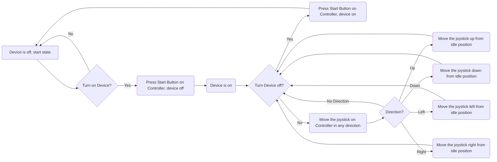

# Introduction 

  Tennis is a time-honored game that can be dated back to the 11th century, played by all ages all around the world. When you think of tennis you think of the intense competition, the player’s personalities, and the feeling of your favorite team winning. What is not talked about however is the cleanup process, after an intense match there is a lot of preparation that goes into getting the next match ready. When consulting the customer, they explained that their current tennis ball collecting method was outdated and broken. The current model is operated by manually pushing the machine, this sometimes causes balls to jam inside the machine from not pushing hard enough. The main objective of this Capstone Design is to make improvements to the current Tennis Ball Collector by adding remote control capability and an accurate ball counter to help make the cleanup process more effective.  

# Restating the Fully Formulated Problem 


The updated machine of our project: 
 
 - Shall be remote control operated using the Raspberry Pi 4 model B [1]

   * Customer wants easier mobility of the device 

 - Shall include a CJMCU-1401 TSL1401CL Linear counting device that is sensor-operated [2]

 - Shall include a DFR0208 Batt charging open frame for powering the electronics within the system [3]

 - Shall include a standard motor 5300 RPM 24V for 4Pcs wheel control [4, 5]

 - Shall include a vibration ERM MTR 14k RPM 3V 1.2 for the tennis ball anti-jamming system [6]

 - Shall collect and sense up to 100 balls at a time with the MakerFocus Lidar range finder sensor module and display with an EA Dogm132L-5 LCD [7,8]

 - Shall be cost-efficient compared to other high-priced competitors such as the Tennibot [9]

 - Shall implement the use of an F710 wireless Gamepad remote controller to operate the machine as an alternative to a new machine such as Playmaker [10]

 - Shall comply with 49 CFR 173.185 to prevent short-circuit damage 

 - Shall comply with the U.S. Hazardous Materials Regulations for dry cell batteries 

 - Shall comply with FCC part 15 under the classification of an unintentional radiator 

  

# Comparative Analysis of Potential Solutions 

The current device used by the Tennessee Tech Tennis team is the Playmate Ball Mower [11]. The machine has an enlarged rolling pin attached to the wheels inside a metal casing that when moved, takes the balls from the ground around to the top into a collection basket. So, in order for the machine to operate as intended, it must be in motion at a speed high enough to transport the balls through the casing into the basket. When consulting the customer on the operation of said machine, some issues pointed out were the mobility, jamming of the device, keeping count of the balls used, and funding. The team addressed the problems as follows: 

To fix the customer’s issue with the machine’s mobility there were a few solutions proposed. They were to leave the machine manual, make it autonomous, or make it remote controlled. If the machine were to be left manual, the problem would still be present since players would have to push around the machine at the end of the practice. This would be of no benefit to the customer since they would be in the same situation they were in before this project with a time-consuming task at the end of the day. As far as autonomy goes, this solution would be very effective for the team, however, the process of converting the machine into an autonomous one would be a great challenge. In a discussion with an advisor the team was informed of the difficulty of creating an autonomous device because of the complexity it would hold. These complexities include sensory issues , implementation of Artificial Intelligence, and time constraints.  In result of these deliberations, the team decided to make the machine remote control operated. This option allows the team to be faced with a challenge in the design process while being able to accomplish the customer's need for easier mobility. 

|Mobility Solutions|Pros|Cons|
|----|----|----|
|Manual|Low cost, simple implementation |Leaves customer with no change to current issue |
|Autonomous|Self-operated, efficient  |Complexity (sensory issues, implementation of AI, time constraints), cost |
|Remote Controlled|Increased mobility, reasonable pricing, achievable in time constraint |User operated, range may pose an issue, remote must be powered |

For the machine jamming issue, two solutions were considered. The first was adding a vacuum mechanism to collect the tennis balls. This in theory sounds like a viable solution, however the implementation of said solution is where issues would be faced. Where will the tube run to? Where will a motor attach? How will the vacuum be powered on and off? All of these questions were considered when discussing how to fix the jamming, and the decision was made to not implement a vacuum. Instead, the proposition of a vibration mechanic was selected. Vibrating the device at the collector will provide enough movement to get tennis balls that are stuck where they are intended while not requiring multiple additions. This solution can be implemented with a simple vibrating motor that will be isolated in one area and won’t require a lot of power in comparison to a vacuum motor.  

|Jamming Solutions|Pros|Cons|
|----|----|----|
|Vacuum|Quick collection, efficiently stops jamming |Installing on current device, power |
|Vibration Device|Provides movement to stop jamming, simple implementation, low power |Vibration strength |

“Have all the balls been collected for the day?” is a question that shouldn’t have to be asked. If the customer uses a select amount of tennis balls at practice, they should have a mechanic to keep count of how many they have collected so far. The proposed solution to this was to implement a counter device in the form of a seven-segment display that works in tandem with sensor. This solution proved to be viable since the addition of a photoelectric sensor and seven segments both provide a challenge to the team while being budget friendly. 

|Count Solutions|Pros|Cons|
|----|----|----|
|Counter|Keeps accurate count, simple implementation, low cost |Seven segment has exposed design |

Finally, the most crucial aspect of the whole project is the funding. New collection devices are already out on the market, but unfortunately for the customer the funding for said devices isn’t there. A device called the Tennibot, that is a fully automated collector that functions similar to a Roomba but for a tennis court, is available but is marketed at a hefty price of $2,995. This is well out of the customer's budget, making it an unrealistic solution. On the cheaper side of the market is the purchase of a new Playmate collector, listed at $595. Although this is immensely cheaper than the Tennibot, over time the same issues happening now will repeat itself. So, Team 3 chose to improve the current machine by implementing the above features to give the customer a machine with similar functionality to the Tennibot plus more at a much lower price. 

|Funding Solutions|Pros|Cons|
|----|----|----|
|Tennibot |Fully autonomous, efficient |Costly, impractical |
|New Playmate |Cost effective |Same device will eventually have same issue,  |
|Team 3 additions |Increased mobility, counting mechanism, anti-jamming, cheaper than Tennibot |More expensive than a new playmate, takes time to develop |


# High-Level Solution 
What we plan to implement: 

 - Installing a Raspberry Pi on the base of the collector to control the hardware and software of the system.
   
 - Vibration motors shall be installed into the collector section of the Tennis Ball collector to help with jamming of Tennis Balls.
   
 - Scanner implemented in the area the balls deposit to capture data from tennis ball intake.
 
 - Seven Segment display shall be placed on the machine and shall be used to show collected data from the scanner.

 - Power system used for hardware connections shall go be placed on the machine for easier connection.

 - Hardware protection shall be installed to cover exposed pieces such as the Rasberry Pi

 - DC motors to help navigate the Tennis Ball Collector installed on the wheels
  
# Hardware Block Diagram 

 ```mermaid
flowchart TD
    A1[Fully Enclosed Basket]
    A2[Subsystem Ball Counter Sensor]
    A3[Wheels]
    A21[Subsystem Vibration Mechanism]
    A22[Subsystem Motors]
    A23[Subsystem Ball Counter Display]
    A24[Receiver]
    A25[Battery]
    A26[Port]
    A27[Microprocessor]
 
    B1[Joystick]
    B2[Start Button]
    B3[Transmitter]
 
    subgraph TennisBallCollector
    A1 --> |Read Balls Going In|A2
    A2 --> |Send Data|A27
    A27 --> |Increment counter by interpreting sensor data|A23
    subgraph MechanicalCasing
    A21 --> |Interrupt Process|A22
    A24 --> |Interpret Controller inputs|A27
    A27 --> |Control Activation|A22
    SubsystemPower --> |3.0V Voltage Supply|A21
    SubsystemPower --> |12V Voltage Supply|A22
    SubsystemPower --> |3.0V Voltage Supply|A23
    SubsystemPower --> |Same supply as Microprocessor, component of it|A24
    SubsystemPower --> |5V 3A Approximate Supply|A27
    SubsystemPower --> |Between 3.0 to 5.0V depending on sensor used|A2
    subgraph SubsystemPower
    A26 --> |3.7V flowing at 6000mA per hour|A25
    end
    end
    A22 --> |Control Speed|A3
    end
 
    subgraph SubsystemRemoteController
    B1 --> |Send Input Signal|B3
    B2 --> |Send Input Signal|B3
    end
 
    B3 --> |Wireless Communication|A24
 
    click A1 "Fully Enclosed Basket for storing the Tennis Balls collected. "
    click A2 "Components [2][3]: Goal is to sense the balls going into the basket and communicate to counter via the microprocessor. Needs voltage amplifier circuit from battery"
    click A21 "Component [5]: If tennis ball gets stuck, activate mechanism and recollect jammed tennis balls. Needs voltage divider circuit from battery"
    click A22 "Component [4]: Used for self propelling the wheels of the Tennis Ball Collector. See DC motor link in budget section. Needs voltage amplifier circuit from battery"
    click A23 "Component [6]: Increment ball counter and display on LCD display located on the surface of mechanical casing. Can't implement on controller because controller used shall be kept minimally modified from original design (Not making controller from scratch)."
    click A24 "Included in Microprocessor [9]: Receive the signals sent by the Remote Controller. Construct voltage amplifier/divider if necessary"
    click A25 "Component [8]: Lithium-ion battery used to power the electronics in the system.  Construct voltage divider to interpret voltage coming in from the port."
    click A26 "Component [7]: Mechanism whether USB-A, USB-C, or micro-cable that is compatible with existing chargers. Assume voltage delivered to port is 20V that needs a voltage divider to convert to 3.7V at 1A."
    click A27 "Microprocessor [9]: Provide communication between systems to interpret data."
    click B1 "Included in Component [10]: Mechanism used to control the direction of the Tennis Ball Collector."
    click B2 "Included in Component [10]: Mechanism used to turn on/off of the Tennis Ball Collector remotely."
    click B3 "Included in Component [10]: Send signals to the Tennis Ball Collector to control."
```

# Operational Flow Chart 




# Atomic Subsystem Specifications 

## Subsystems 

### RC Controller

The RC Controller System section shall use a wireless controller to operate the DC motors and Dual Shaft wheels attached on the collector.
- Shall use a Gamepad as a wireless controller.
- Shall utilize a 2.4 GHz USB nano reciever to communicate to the Raspberry Pi.
- Shall properly allow the collector to move foward, to move in reverse, and be able to turn left or right.
- Shall allow for variable speed control of the DC motors.
- Shall include an emergency stop function to immediately halt all motor operations.
- Shall use an intuitive button layout so that controlling is easy.


  
### Motors Systems 

The Motor Systems subsystem section shall increase the mobility of the Tennis Ball Collector by adding DC motors to the already established wheels.
- The DC motors [4] shall be connected to the power supply and Raspberry Pi.
- THe Dual Shaft Wheels [5] shall be connected by the Raspberry Pi.
- The rotation of the motors shall control the movement of the collector without any manual help.
- The DC motors shall recieve it's directions from the RC controller system.
- Shall continuely control the movement of the tennis ball collector.
- Shall operate continuously at rated power and rated voltage without exceeding temperature limits, as specified by IEC 60034-1
- Shall have a data rates based on the frequency: 2.4 GHz up to 250 kbps and 915 MHz, 40 kbps

### Counting Sensors Systems 

The Counting Sensor System section shall be expected to detect and keep track of the counted and collected balls while the entire system runs. 
- The Lidar range finder sensor [7] shall have a digital signal connected to the Raspberry Pi.
- The Sensor shall take an accurate measurement of ball and display this data onto the LCD Display.
- The Sensor shall be connected via GPIO pins on the Raspberry Pi.
- Shall enable seamless communication between transducers and the central microprocessor or other connected digital systems.
- Shall enable remote communication, configuration, and management of transducers over different network protocols.

### Counting Display Systems 

The Counting Display Systems section shall implement a LCD Display that will display the amount of collected tennis balls.
- The LCD display shall use Serial Communication to communicate with the Counting Sensor [7] and Raspberry Pi [1] components.
- The subsystem shall display an accurate account of collected balls throughout the entire collection process.
- The LCD display shall be connected to a circuit that supplies the required voltage of approximately 3.3V to the LCD display. 
   
### Vibration Systems 

The Vibration Motor Systems section shall intergrate the vibration motor in a way that dirupts cluttered tennis balls in the roller. 
- The DC Vibration Motor [6] shall get it's power directly from the Lithium Polymer Battery.
- The motor shall be expected to run and help with disrupting the collection of balls while the entire system runs.
- The methods for measuring and calculating various losses (iron losses, copper losses, etc.) shall be standardized to maintain accuracy and repeatability.
- Machines mounted according to specified configurations shall maintain compliance with vibration limits to ensure operational stability
- Machines shall comply with noise limits specified in IEC 60034-9 to reduce environmental noise and meet workplace safety regulations
- Noise levels shall be measured using standard methods, and machines shall not exceed the specified dB limits when operating under rated conditions
- Machines shall meet the specified vibration limits to avoid damage or excessive wear. Measurements shall be taken at both no-load and rated load conditions to ensure compliance
- Machines shall undergo vibration testing under standardized conditions to verify that they fall within permissible vibration levels for their class

### Power Supply Systems 

The Power Supply Systems section will focus on powering the system and for the hardware such as the DC motors, vibrating motors, display, and sensors. 
- The 3.7 V Lithium Polymer Rechargeable Battery [12] shall power the hardware of the entire system, including the Raspberry Pi
- Lithium battery will supply atleast 8 amps to DC motors, and Vibration motors.
- The Lithium Rechargeable Battery shall use an Open Frame Battery Charger [3] to gain charge.
- Batteries shall be rechargable so it can be used anytime as long as it has charge.
- Batteries shall be subjected to vibration tests, to test combatibility with vibration motor the team will test the battery while the vibration motor acts at the same time.
- Cells and batteries shall be constructed in a way that minimizes overcomplication of wiring.
  
# Ethical, Professional, and Standards Considerations 

### 1. IEEE (Institute of Electrical and Electronics Engineers)

a. IEEE 1451 : Family of standards covering smart transducer development and integration which can be applied to sensor-device communication
  - Each smart transducer shall incorporate a Transducer Interface Module (TIM) that connects to the networked system
  - Each transducer shall include mechanisms to detect and report errors, faults, or malfunctions
  - Shall manage power efficiently to support remote and low-power transducer operation; including sleep modes and power-saving mechanisms, extending the battery life in battery-operated applications

### 2. IEC (International Electrotechnical Commission)

a. IEC 60730 : International standards focused on safety and performance requirements for automatic control devices which can be applied to considered sensors and RC devices
  -  Controls shall provide protection against electric shock, with enclosures and insulation to prevent users from accidental contact with live parts
  -  The leakage current of the control shall not exceed specified limits to prevent electrical hazards
  -  Controls shall enter a safe shutdown mode if they detect conditions that could lead to unsafe operation, such as excessive temperature or a failure in the control circuit
  -   Software in controls shall include error-handling routines to detect and respond to faults or abnormal conditions, ensuring continued safe operation or shutdown
  -   Controls shall be accompanied by installation and user instructions, providing necessary details for safe setup, operation, and maintenance by end users and installers


c. IEC 62133 : Covers safety requirements for lithium-ion and lithium polymer batteries that can be applied to powering our project
  -  Batteries shall incorporate protective devices to prevent overcharging, over-discharge, and overheating, with reliable mechanisms to limit voltage and current to safe levels
  -  Batteries shall operate safely within specified temperature ranges, with no risk of rupture, fire, or explosion due to temperature stress
  -  Any protection circuitry within the battery pack shall function reliably under all operational conditions, including overcharge, over-discharge, and short circuit scenarios
 

# Resources 
  The project requires hardware and software resources to create an efficient, portable, and cost-effective remote-controlled tennis ball collector. Key hardware includes the RC transmitter, receiver, Raspberry Pi 4B, battery, LCD, vibration motor, DC motors, wheels, and sensors for ball detection. The components for prototyping are relatively inexpensive, and the total estimated cost for prototyping is $1,500. This cost allows for testing of components in case they break.

  The developmental environments for programming Raspberry Pi and any RF control system testing will be essential. The software resources will be used to design, simulate, and test the functionality of the tennis ball collector.  

# Budget 

  The budget proposal covers the key subsystems of the tennis ball collector, with a total of $1,500 for the entire project: 

### Prototyping ($303.99- $403.99): 

| Part name | Product Number | Cost | 
| ---------- | --------- | --------- |
| RC transmitter/receiver | 940-000117 | 50-100 | 
| Raspberry Pi 4B | 4292 | 45 |
| battery | LP906090JH+PCM+2 WIRES 70MM | 20-50 | 
| Charger | DFR0208 | 15-30 | 
| LCD display | EA DOGM132L-5 | 15 |
| Vibration motor | VZ4KC1B1051202 | 5-10 |
| Wheels | B07DQGX369 | 11 | 
| DC Motors | SE30R2NTCD | 100 |
| TSL140TFmini-S Micro Lidar Module (Optical/Infrared Array Sensor)| B075V5TZRY | 42.99 |

 

# Skills 


Ashli: Experienced with Microcomputing (Assembly programming), wiring, database management, and Quartus Prime. Working on Motor Subsystem 

Carter: Experience with RC cars, DC motors, vibration motors, programing, microcomputers, FPGAs. Working on RC Subsystem 

Cindy: Experienced with object-oriented programming, a little RANCS autonomous vehicle programming, microcomputing, and digital systems. Working on the Vibration Subsystem

Gabriel: Worked with Arduino coding, Soldering, Microcontrollers, PLCs and generally coding languages. Working on Power Subsystem. 

Maxwell: Experience with programming (C, C++, assembly, python), microcomputers, and digital system design. Working on Counting Sensor Subsystem

Tate: Experienced with Data Structures in C and C++, Matlab Scripting, and general coding of microcontrollers that use Arm, ArmV8, and VHDL to interface. Working on Counting Display Subsystem
 

# Timeline 

  ```mermaid
gantt
    title Timeline
    dateFormat  YYYY-MM-DD
    section Section
    Stakeholder meeting      :   2024-09-12, 1d
    Project proposal draft   :    2024-09-09, 7d
    Finalizing details with advisor and customer :  2024-09-12, 1d
    Project proposal final   :   2024-09-24, 7d
    Product research         :   2024-09-12, 30d
    Conceptual design        :   2024-10-01, 27d
    Detailed design          :   2024-10-28, 32d
    Final presentation       :   2024-10-28, 32d
``` 

# References 
[1] A. Industries, “Raspberry pi 4 model B - 2 GB RAM,” adafruit industries blog RSS, <https://www.adafruit.com/product/4292#description> (accessed Nov. 4, 2024). 

[2] “CJMCU-1401 TSL 1401CL Linear CCD,” Amazon.in, <https://www.amazon.in/CJMCU-1401-TSL1401CL-Linear-Wide-Angle-Tracking/dp/B09D8NK773> (accessed Nov. 4, 2024).   

[3] “DFR0208,” DigiKey Electronics, <https://www.digikey.com/en/products/detail/dfrobot/DFR0208/6579347> (accessed Nov. 4, 2024). 

[4] “SE30R2NTCD,” DigiKey Electronics, <https://www.digikey.com/en/products/detail/nmb-technologies-corporation/SE30R2NTCD/6021451> (accessed Nov. 4, 2024).  

[5] Amazon.com: Yeeco 4pcs DC electric motor 3-6V dual shaft geared TT magnetic gearbox engine with 4Pcs plastic car tire wheel, mini Φ67mm SMART RC car robot tires model gear parts: Toys & games, <https://www.amazon.com/Electric-Magnetic-Gearbox-Plastic-Yeeco/dp/B07DQGX369> (accessed Nov. 4, 2024).  

[6] “VZ4KC1B1051202,” DigiKey Electronics, <https://www.digikey.com/en/products/detail/vybronics-inc/VZ4KC1B1051202/6009917> (accessed Nov. 4, 2024).   

[7] “MakerFocus Lidar range finder sensor module single-point micro ranging module compatible with Pixhawk, Arduino with UART Communication Interface,” Amazon.ca: Electronics, <https://www.amazon.ca/MakerFocus-Single-Point-Ranging-Pixhawk-Compatible/dp/B075V5TZRY> (accessed Nov. 4, 2024).  

[8] “EA DOGM132L-5,” DigiKey Electronics, <https://www.digikey.com/en/products/detail/display-visions/EA-DOGM132L-5/4896710> (accessed Nov. 4, 2024). 

[9] “Tennibot ,” Tennibot, <https://www.tennibot.com/buy/> (accessed Oct. 7, 2024). 

[10] “F710 wireless Gamepad,” Console Style - Logitech G, <https://www.logitechg.com/en-us/products/gamepads/f710-wireless-gamepad.940-000117.html> (accessed Nov. 4, 2024).

[11] “Ball Mower 2.0,” PLAYMATE Tennis, <https://www.playmatetennis.com/ball-mower-2/> (accessed Oct. 7, 2024).

[12] “LP906090JH+PCM+2 wires 70mm,” DigiKey Electronics, <https://www.digikey.com/en/products/detail/jauch-quartz/LP906090JH-PCM-2-WIRES-70MM/9560999> (accessed Nov. 4, 2024).  
  

# Statement of Contributions 

  

Tate Finley – Fully Formulated Problem (shall statements), hardware block diagram, Operational flow chart

Cindy Escobar – Resources, Budget, References 

Gabriel Dubose – High-Level Solutions, comparative solutions, introductions, Atomic Subsystems

Carter Brady – Comparative analysis of potential solutions, Ethical, Professional, and standards considerations

Ashli Watkins – Ethics, Professional, and Standards Considerations section

Maxwell Wynne – fully formulated problem, comparative analysis of potential solutions
 
