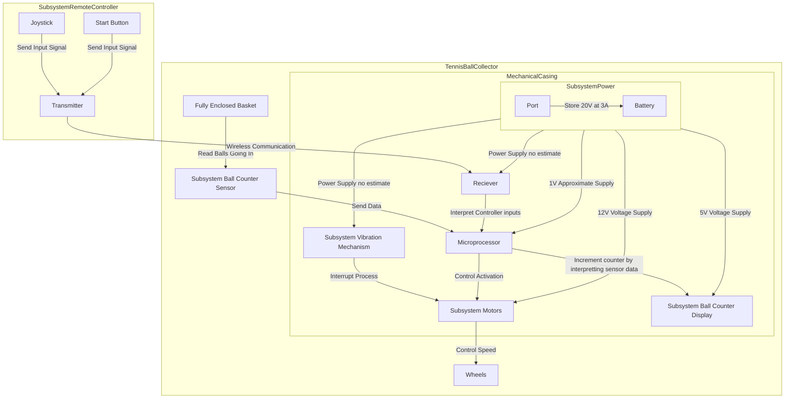
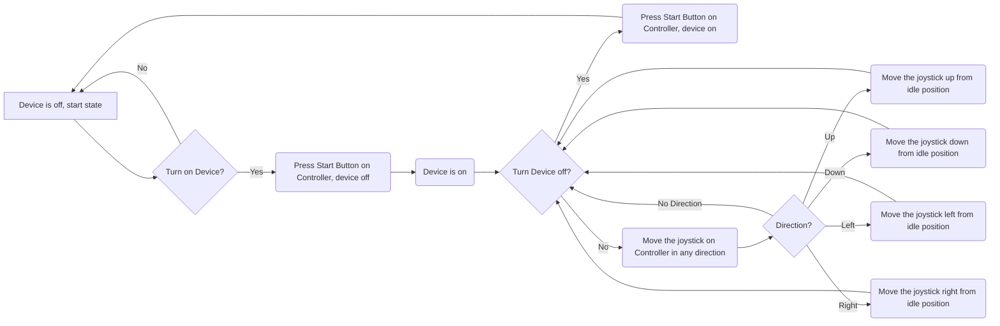

# Introduction 

  Tennis is a time-honored game that can be dated back to the 11th century, played by all ages all around the world. When you think of tennis you think of the intense competition, the player’s personalities, and the feeling of your favorite team winning. What is not talked about however is the cleanup process, after an intense match there is a lot of preparation that goes into getting the next match ready. When consulting the customer, they explained that their current tennis ball collecting method was outdated and broken. The current model is operated by manually pushing the machine, this sometimes caused balls to jam inside the machine from not pushing hard enough. The main objective of this Capstone Design is to make improvements to the current Tennis Ball Collector by adding remote control capability and an accurate ball counter to help make the cleanup process more effective.  

# Restating the Fully Formulated Problem 


The updated machine of our project: 
 
 - Shall be remote control operated using an Raspberry Pi

   * Customer wants easier mobility of device 

 - Shall include a counting device that is sensor operated 

 - Shall include a charging port for powering the electronics within the system 

 - Shall include motors for controlling the wheels of the system

   * The connection of the RC motors will cause the self propulsion of the machine

 - Shall include a tennis ball anti-jamming system 

 - Shall collect and manage up to 100 balls at a time 

 - Shall be cost-efficient, not exceeding $1,500 for total  

   * Playmaker's Manual Ball Mower valued at $595 

   * Tennibot Rover Autonomous Tennis Assistant [Collector] valued at $2995 

 - Shall comply with 49 CFR 173.185 to prevent short-circuits damage 

 - Shall comply with the U.S. Hazardous Materials Regulations for dry cell batteries 

 - Shall comply with FCC part 15 under the classification of an unintentional radiator 

  

# Comparative Analysis of Potential Solutions 

The current device used by the Tennessee Tech Tennis team is the Playmate Ball Mower. The machine has an enlarged rolling pin attached to the wheels inside a metal casing that when moved, takes the balls from the ground around to the top into a collection basket. So, in order for the machine to operate as intended, it must be in motion at a speed high enough to transport the balls through the casing into the basket.

When Team 3 began developing solutions for the tennis ball collector, they first had to address the problems at hand. Said issues were mobility, jamming, data, and funding. The thought process of the Team is as follows: 

  To fix the customer’s issue with the machine’s mobility there were a few solutions proposed. They were to leave the machine manual, make it autonomous, or make it remote controlled. If the machine were to be left manual, the problem would still be present since players would have to push around the machine at the end of the practice. This would be of no benefit to the customer since they would be in the same situation they were in before this project with a time-consuming task at the end of the day. As far as autonomy goes, this solution would be very effective for the team, however, the process of converting the machine into an autonomous one would be a great challenge. In a discussion with an advisor the team was informed of the difficulty of creating an autonomous device because of the complexity it would hold. In result of these deliberations, the team decided to make the machine remote control operated. This option allows the team to be faced with a challenge in the design process while being able to accomplish the customer's need for easier mobility. 

  For the machine jamming issue, two solutions were considered. The first was adding a vacuum mechanism to collect the tennis balls. This in theory sounds like a viable solution, however the implementation of said solution is where issues would be faced. Where will the tube run to? Where will a motor attach? How will the vacuum be powered on and off? All of these questions were considered when discussing how to fix the jamming, and the decision was made to not implement a vacuum. Instead, the proposition of a vibration mechanic was selected. Vibrating the device at the collector will provide enough movement to get tennis balls that are stuck where they are intended while not requiring multiple additions. This solution can be implemented with a simple vibrating motor that will be isolated in one area and won’t require a lot of power in comparison to a vacuum motor.  

  “Have all the balls been collected for the day?” is a question that shouldn’t have to be asked. If the customer uses a select amount of tennis balls at practice, they should have a mechanic to keep count of how many they have collected so far. The proposed solution to this was to implement a counter device in the form of a seven-segment display that works in tandem with sensor. This solution proved to be viable since the addition of a photoelectric sensor and seven segments both provide a challenge to the team while being budget friendly. 

  Finally, the most crucial aspect of the whole project is the funding. New collection devices are already out on the market, but unfortunately for the customer the funding for said devices isn’t there. A device called the Tennibot, that is a fully automated collector that functions similar to a Roomba but for a tennis court, is available but is marketed at a hefty price of $2,995. This is well out of the customer's budget, making it an unrealistic solution. On the cheaper side of the market is the purchase of a new Playmate collector, listed at $595. Although this is immensely cheaper than the Tennibot, the customer still does not want to purchase a new machine. So, to face the issue of funding for the project, Team 3 chose to adjust the customer’s current device to fit their needs with a practical budget in mind.

# High-Level Solution 

 

What we plan to implement: 

 - Shall use a Raspberry Pi as the main system of controll for hardware and software system.
   
 - Vibration motors shall be installed into the collector section of the Tennis Ball collector to help with jamming of Tennis Balls.
   
 - Scanner to capture data from tennis ball intake.
 
 - Seven Segment display shall be used to show collected data from the scanner.

 - Power system used for hardware connections

 - Hardware protection shall be used to cover exposed pieces

 - Bluetooth Connection shall be used for the control of the motors

 - DC motors to help navigate the tennis ball collector

  
# Hardware Block Diagram 


  

# Operational Flow Chart 




# Atomic Subsystem Specifications 

## Subsystems 

### RC Controller

 - Signal Type: Wireless Communication 

 - Signal Direction: Input for Transmitter

 - Communication Protocols: Bluetooth 

 - Expectation: The Controller shall send inputs to the Motors for movement  

### Motors Systems 

 - Signal Type: Power Signal 

 - Signal Direction: Output for Receiver and RC Motors 

 - Communication Protocols: PPM for Receiver 

 - Expectation: Continuely control the movement of the tennis ball collector
   
### Counting Sensors Systems 

 - Signal Type: Digital Signal

 - Signal Direction:  Output for Seven Segments 

 - Communication Protocols: BCD 

 - Expectation: While the entire system runs, this sensor system shall detect and keep track of the counted and collected balls.  

### Counting Display Systems 

 - Signal Type: Serial Communication 

 - Signal Direction: Output for Seven Segments 

 - Communication Protocols: BCD 

 - Expectation: Display the collected data of the amount of collected tennis balls
   
### Vibration Systems 

 - Signal Type: Power Signal 

 - Signal Direction: Output 

 - Communication Protocols: PWM motor 

 - Expectation: While the Entire system is running the vibration system shall also run and help with disrupting the collection of balls 

### Power Supply Systems 

 - Signal Type: Electric Power 

 - Signal Direction: Output 

 - Communication Protocols: Electricty 

 - Expectation: Power 

# Ethical, Professional, and Standards Considerations 


## IEEE 

 - IEEE 802.15.4 (Low-rate wireless personal area networks, useful for RC communications) 

 - IEEE 1451 (Standards for smart transducers, relevant for sensor integration with servos) 

## ISO 

 - ISO 25119 (Safety for control systems in machinery, including RC and DC-motor-driven systems) 

 - ISO 10303 (Automation systems and integration, relevant for computer-controlled RC systems) 

## IEC 

 - IEC 60034 (Standards for electric motors, which includes DC motors) 

 - IEC 60730 (Automatic electrical controls, important for automated RC and DC systems) 

 

## SAE International (Society of Automotive Engineers) 

 - SAE AS-5684 (Control system servomechanisms) 

 - SAE J1939 (Communication protocols in vehicles, which may be used in advanced RC systems) 

## FCC (Federal Communications Commission) 

 - FCC Part 15 (Regulates unlicensed radio-frequency devices, including RC transmitters and receivers) 

 - FCC Part 97 (Amateur radio service, for RC enthusiasts using specialized frequencies) 

 

   If we add specifications/constraints based on the standards we read, address the reason we considered to add them 

 

# Resources 
 

  The project requires hardware and software resources to create and efficient, portable, and cost-effective remote-controlled tennis ball collector. Key hardware includes the RC transmitter, receiver, Raspberry Pi 4B, battery, LCD, vibration motor, DC motors, wheels, and sensors such as the photoelectric sensor for ball detection. Additionally, lab equipment like oscilloscopes and computers for interfacing with the processor will be necessary for testing. The components for prototyping are relatively inexpensive, and the total estimated cost for prototyping is $1,000.  

  The software resources include CAD software for designing the final version of the collector. Additionally, developmental environments for programming Raspberry Pi and any RF control system testing will be essential. The software resources will be used to design, simulate, and test the functionality of the tennis ball collector.  

# Budget 


  The budget proposal covers the key subsystems of the tennis ball collector, with a total of $1,500 for the entire project: 

### Prototyping ($376.90- $486.90): 

| Part name | Cost | Link |
| ---------- | --------- | --------- |
| RC transmitter/receiver | 50-100 | [Click me](https://www.logitechg.com/en-us/products/gamepads/f710-wireless-gamepad.940-000117.html) |
| Raspberry Pi 4B | 45 | [Click me](https://www.adafruit.com/product/4292?src=raspberrypi) |
| battery | 20-50 | [Click me](https://www.digikey.com/en/products/detail/jauch-quartz/LP906090JH-PCM-2-WIRES-70MM/9560999) |
| Charger | 15-30 | [Click me](https://www.digikey.com/en/products/detail/dfrobot/DFR0208/6579347) |
| LCD display | 15 | [Click me](https://www.digikey.com/en/products/detail/display-visions/EA-DOGM132L-5/4896710) |
| Vibration motor | 5-10 | [Click me](https://www.digikey.com/en/products/detail/vybronics-inc/VZ4KC1B1051202/6009917) |
| Wheels  NEED LINK | 50 | [Click me](https://www.logitechg.com/en-us/products/gamepads/f710-wireless-gamepad.940-000117.html) |
| DC Motors | 100 | [Click me](https://www.digikey.com/en/products/detail/nmb-technologies-corporation/SE30R2NTCD/6021451) |
| Diffused Beam Photoelectric Sensor NEED LINK | 76.90 | [Click me](https://www.logitechg.com/en-us/products/gamepads/f710-wireless-gamepad.940-000117.html) |

 

# Skills 


Ashli: Experienced with Microcomputing (Assembly programming), wiring, database management, and Quartus Prime. 

Carter: Experience with RC cars, DC motors, vibration motors, programing, microcomputers, FPGAs. 

Cindy: Experienced with object-oriented programming, a little RANCS autonomous vehicle programming, microcomputing, and digital systems. 

Gabriel: Worked with Arduino coding, Soldering, Microcontrollers, PLCs and generally coding languages. 

Maxwell: Experience with programming (C, C++, assembly, python), microcomputers, and digital system design. 

Tate: Experienced with Data Structures in C and C++, Matlab Scripting, and general coding of microcontrollers that use Arm, ArmV8, and VHDL to interface. 
 

# Timeline 

  ```mermaid
gantt
    title Timeline
    dateFormat  YYYY-MM-DD
    section Section
    Stakeholder meeting      :   2024-09-12, 1d
    Project proposal draft   :    2024-09-09, 7d
    Finalizing details with advisor and customer :  2024-09-12, 1d
    Project proposal final   :   2024-09-24, 7d
    Product research         :   2024-09-12, 30d
    Conceptual design        :   2024-10-01, 27d
    Detailed design          :   2024-10-28, 32d
    Final presentation       :   2024-10-28, 32d
``` 

# References 
[1] “Ball Mower 2.0,” PLAYMATE Tennis, <https://www.playmatetennis.com/ball-mower-2/> (accessed Oct. 7, 2024). 

[2] “Tennibot ,” Tennibot, <https://www.tennibot.com/buy/> (accessed Oct. 7, 2024). 

[3] “Raspberry Pi 4 Model B,” Adafruit Official Store, <https://www.adafruit.com/product/4292?src=raspberrypi> (accessed Nov. 1, 2024). 

[4] “5035,” DigiKey Electronics, <https://www.digikey.com/en/products/detail/adafruit-industries-llc/5035/14625568?s=N4IgjCBcoMw1oDGUBmBDANgZwKYBoQB7KAbRAHYYxyAGEAXQIAcAXKEAZRYCcBLAOwDmIAL4EALGABMCEMkjps%2BIqRAwAbAFYqmhszaROPAcJFiQMyGQy8WAC14BXALYACXoX4MRQA> (accessed Oct. 7, 2024). 

[5] DigiKey - electronic components distributor, <https://www.digikey.com/> (accessed Oct. 7, 2024). 

[6] “DigiKey Home,” DigiKey, <https://www.digikey.com/> (accessed Oct. 7, 2024). 

[7] “EA DOGM132L-5,” DigiKey Electronics, <https://www.digikey.com/en/products/detail/display-visions/EA-DOGM132L-5/4896710> (accessed Oct. 7, 2024). 

[8] “VZ4KC1B1051202,” DigiKey Electronics, <https://www.digikey.com/en/products/detail/vybronics-inc/VZ4KC1B1051202/6009917> (accessed Oct. 7, 2024). 

[9] “125mm all-terrain robotics wheel set,” Studica, <https://www.studica.com/studica-robotics-brand/125mm-all-terrain-wheel-set> (accessed Oct. 7, 2024). 

[10] “Servos 1142,” DigiKey Electronics, <https://www.digikey.com/en/products/detail/adafruit-industries-llc/1142/5154658> (accessed Oct. 7, 2024). 

[11] “Photo sensors - diffuse,” Stack, <https://stack-light.com/products/diffuse-photo-sensors?variant=44817176461531&currency=USD&gad_source=1&gclid=Cj0KCQjwjY64BhCaARIsAIfc7YZnyGzIxWyyUjUTWbqxsLxM_eVRJhUGIMK7RvBAOAtBdTkI59_Xu8YaAmwzEALw_wcB> (accessed Oct. 7, 2024). 
 

 

  

# Statement of Contributions 

  

Tate Finley – Fully Formulated Problem (shall statements), hardware block diagram, Operational flow chart, Counting Display Subsystem

Cindy Escobar – Resources, Budget, References, Vibration Subsystem

Gabriel Dubose – High Level Solutions, comparative solutions, introductions, Power Subsystem 

Carter Brady – Comparative analysis of potential solutions, Ethical, Professional, and standards considerations, RC Subsystem 

Ashli Watkins – Ethics, Professional, and Standards Considerations section, Motor Subsystem 

Maxwell Wynne – fully formulated problem, comparative analysis of potential solutions, Counting Sensor Subsystem
 
