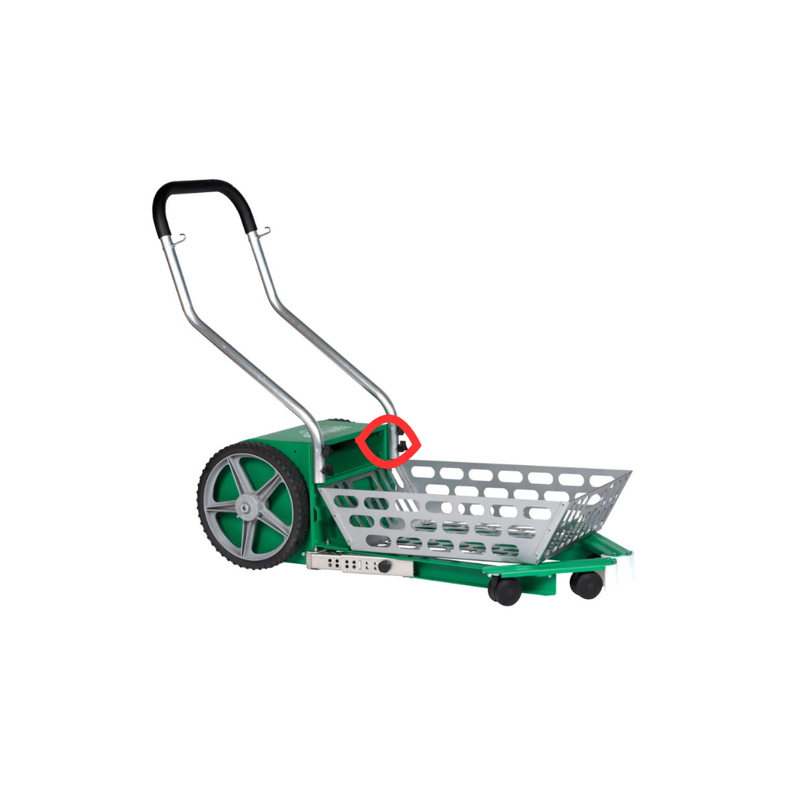
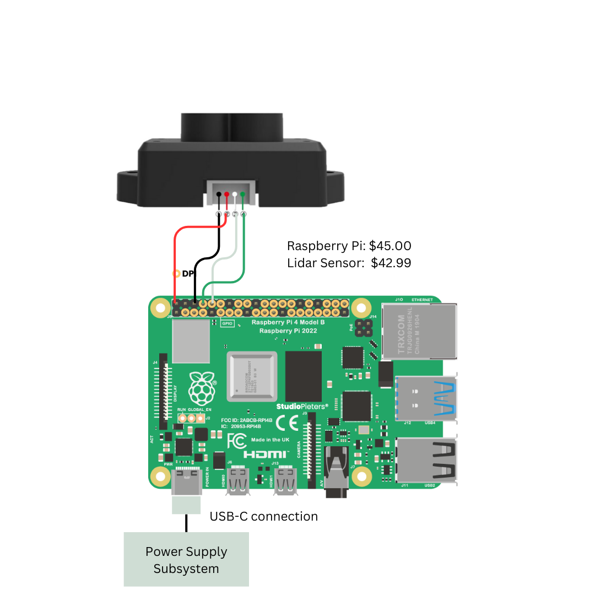
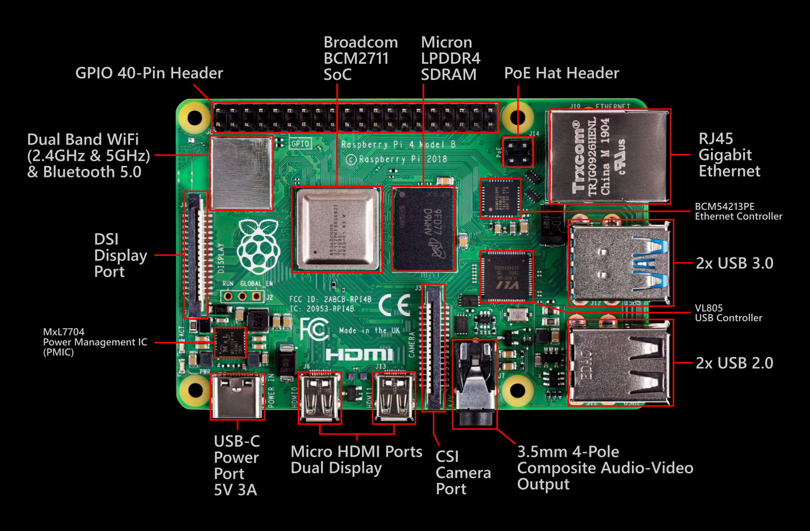
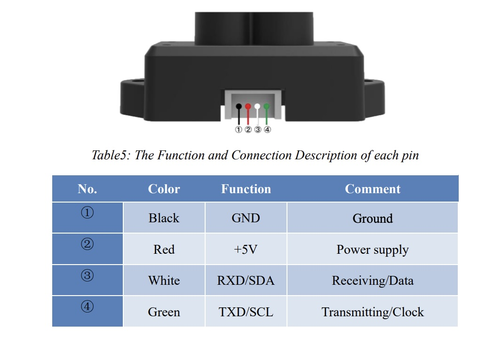
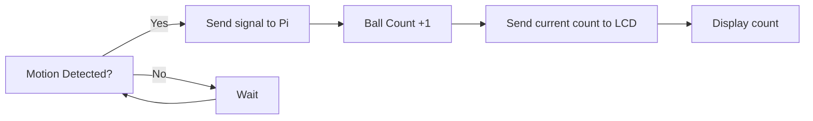

# Detailed Design

## Function of the Subsystem
The Sensor Subsystem’s role within the entire system is to track the amount of tennis balls entering the collection basket and send this amount to the LCD display all while the machine operates. 

## Specifications and Constraints
The Counting Sensor System section shall be expected to detect and keep track of the counted and collected balls while the entire system runs. 
- The Lidar range finder sensor [1] shall have a digital signal connected to the Raspberry Pi. 

    - Rationale: The Raspberry Pi [2] will house the software along with the power source for the Lidar Sensor 

- The Sensor shall take an accurate measurement of balls and display this data onto the LCD Display. 

    - Rationale: To allow the user to get an accurate count of how many balls have been collected 

- The Sensor shall be connected via GPIO pins on the Raspberry Pi. 

    - Rationale: This will provide immediate feedback between the sensor and the Pi 

- Shall enable seamless communication between transducers and the central microprocessor or other connected digital systems. 

    - Rationale: This will ensure accurate data processing in real time 

- Shall enable remote communication, configuration, and management of transducers over different network protocols. 

    - Rationale: allows maintenance to be done remotely without having to go to the physical device 

## Overview of Proposed Solution

The proposed solution for the Sensor subsystem is to use the Lidar Sensor, that is Raspberry Pi compatible, to track incoming balls into the collection basket. The Lidar sensor has frame frequency of 100 Hz and an ambient light immunity of 70 Klux, making it an accurate addition that will be able to operate in different lighting environments. The sensor has a blind zone within the first 10 cm that will be avoided by using an additional sensor on the opposite side with a slight offset from the other to capture objects in each of their dead zones. This subsystem will work in tandem with the Display subsystem to show the user how many balls have been collected. It will be connected to the Raspberry Pi via GPIO pins to allow accurate, seamless, and remote communication. The Pi itself will host the programming software for the sensor that will configure the pins and increment a value as motion is detected on the sensor. 

Below is where the sensor will be located on the Playmate[3], connected via ST2.9 screws. With it being located here, it shouldn't have the risk of being triggered by any other objects, as the only objects in passing will be tennis balls.

## Interface with Other Subsystems

The sensor subsystem works with the power subsystem and the display subsystem. It doesn't, however, contain a direct physical connection to these subsystems but is instead connected using the Raspberry Pi as a medium. The sensor has 4 wires that need to be connected to the Pi. These are the GND, Voltage, RXD/SDA, and TXD/SCL. The specific wiring configuration of this can be seen below in the following section. Once connected and powered, on operation the sensor will detect motion (the ball) passing and send a signal to the Pi. From here the Pi will recognize that a ball has passed and increase the ball count. While this is happening, the current count is displayed on the LCD and will update as a new signal is received. 

## Buildable Schematic 

## Printed Circuit Board Layout

Raspberry Pi

Lidar Sensor

## Operational Flowchart

## BOM

| Manufacteror | Product Number | Distributor | Distributor Part number | Quantity | Price | Purchase Link |
|--------------|----------------|-------------|-------------------------|----------|-------|---------------|
| Raspberry Pi Holdings Ltd | 4292 | Raspberry Pi | 4292 | 1 | $45 | [link](https://www.adafruit.com/product/4292?src=raspberrypi) |
| MakerFocus | 8541545775 | Amazon | 8541545775 | 2 | $85.98 | [link](https://www.amazon.com/MakerFocus-Single-Point-Ranging-Pixhawk-Compatible/dp/B075V5TZRY)|
|‎ IIVVERR | 6a380d8489a859e61b3daa6672ea5d | Amazon | 6a380d8489a859e61b3daa6672ea5d | 50 | $6.50 | [link](https://www.amazon.com/IIVVERR-ST2-2-2-9-3-5-3-9-4-2-4-8-self-Tapping-Screws-Stainless/dp/B0DGXX1KVX/ref=sr_1_1?crid=1UJ6DZOI0BW9Y&dib=eyJ2IjoiMSJ9.8s75-b684CVmbyvM54fdPwJ9pGoxfpTr5EKv7AarnRXSC5K5lKNLrq7cdCqkL_adi8zxkOTtGpUP6dqbCbvWsKd8nXLX4tE-Nz_wJzJ2QYAriAWhNA3hqPIfK69MP6pSQlnSs8Xq_8yY0vL7Y7KOzV_C6vSPiShyA172LFyus-NMQSaH21Y4ev13u28HwyqfaGTzAHymCLpXtvOvOaeKVBkR3XhE508le3fnwV0tZKY1nHcYMcvdx2EjO9hNC0-fcJKTNtPljhzHKeTCDVueiMi15cHq7r069ku_WTqaoLw.vuRCfqEmREvj4VTijgvc74aX6S8HFid8kWjhuWvMvWw&dib_tag=se&keywords=ST2.9%2Bscrew&qid=1733941531&s=hi&sprefix=st2.9%2Bscrew%2Ctools%2C91&sr=1-1&th=1)|

## Analysis

The Sensor subsystem will perform its intended function all while meeting the constraints. It will have connections via GPIO to the Raspberry Pi and send signals when a ball passes it. The signal communication will be seamless and allow a count to be recognized and displayed on the LCD display for the user to view. Since it is using the Pi, any maintenance that needs to be performed on the sensor can be done remotely if it is related to the software. The implementation of this subsystem is cost effective as it uses two components, one of which is used in other subsystems. This means the sensor subsystem will be able to perform its operation in an efficient and cost-effective manner. 

## References

[1] TFmini-s Micro Lidar Sensor https://www.amazon.com/Benewake-TFmini-S-Single-Point-Raspberry-Interface/dp/B08D1XVRV5

[2] Raspberry Pi 4 Model B https://www.adafruit.com/product/4292#description

[3] Playmate Ball Mower www.playmatetennis.com/ball-mower/
