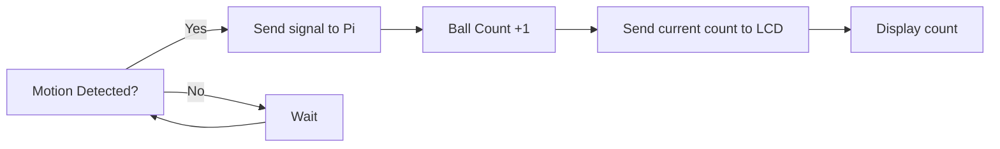

# Detailed Design

## Function of the Subsystem
The Sensor Subsystem’s role within the entire system is to track the amount of tennis balls entering the collection basket and send this amount to the LCD display all while the machine operates. 

## Specifications and Constraints
The Counting Sensor System section shall be expected to detect and keep track of the counted and collected balls while the entire system runs. 
- The Lidar range finder sensor [1] shall have a digital signal connected to the Raspberry Pi. 

    - Rationale: The Raspberry Pi [2] will house the software along with the power source for the Lidar Sensor 

- The Sensor shall take an accurate measurement of balls and display this data onto the LCD Display. 

    - Rationale: To allow the user to get an accurate count of how many balls have been collected 

- The Sensor shall be connected via GPIO pins on the Raspberry Pi. 

    - Rationale: This will provide immediate feedback between the sensor and the Pi 

- Shall enable seamless communication between transducers and the central microprocessor or other connected digital systems. 

    - Rationale: This will ensure accurate data processing in real time 

- Shall enable remote communication, configuration, and management of transducers over different network protocols. 

    - Rationale: allows maintenance to be done remotely without having to go to the physical device 

## Overview of Proposed Solution

The proposed solution for the Sensor subsystem is to use the Lidar Sensor, that is Raspberry Pi compatible, to track incoming balls into the collection basket. This subsystem will work in tandem with the Display subsystem to show the user how many balls have been collected. It will be connected to the Raspberry Pi via GPIO pins to allow accurate, seamless, and remote communication. The Pi itself will host the programming software for the sensor that will configure the pins and increment a value as motion is detected on the sensor. 

## Interface with Other Subsystems

The sensor subsystem works with the power subsystem and the display subsystem. It doesn't, however, contain a direct physical connection to these subsystems but is instead connected using the Raspberry Pi as a medium. The sensor has 4 wires that need to be connected to the Pi. These are the GND, Voltage, RXD/SDA, and TXD/SCL. The GND will be connected to pin 6 of the Pi while the voltage will be connected to pin 2 to provide 5 V. The RXD and TXD will connect to pins 8 and 10 respectively. Once connected and powered, on operation the sensor will detect the ball passing and send a signal to the Pi. From here the Pi will recognize that a ball has passed and increase the ball count. While this is happening, the current count is displayed on the LCD and will update as a new signal is received. 

## Buildable Schematic 

Integrate a buildable electrical schematic directly into the document. If the diagram is unreadable or improperly scaled, the supervisor will deny approval. Divide the diagram into sections if the text and components seem too small.

The schematic should be relevant to the design and provide ample details necessary for constructing the model. It must be comprehensive so that someone, with no prior knowledge of the design, can easily understand it. Each related component's value and measurement should be clearly mentioned.

## Printed Circuit Board Layout

## Operational Flowchart

## BOM

A complete list of all components needed for the design must be given with the cost of each component and the total cost of the subsystem. The BOM should be a markdown table. Make sure to to provide the manufacteror, part number, distributor, distributor part number, quantity, and price. Also provide a url where the product can be purchased from. If the componenet is refernced on your schematic make sure to include the component name.

Provide a comprehensive list of all necessary components along with their prices and the total cost of the subsystem. This information should be presented in a tabular format, complete with the manufacturer, part number, distributor, distributor part number, quantity, price, and purchasing website URL. If the component is included in your schematic diagram, ensure inclusion of the component name on the BOM (i.e R1, C45, U4).

| Manufacteror | Product Number | Distributor | Distributor Part number | Quantity | Price | Purchase Link |
|--------------|----------------|-------------|-------------------------|----------|-------|---------------|
| Raspberry Pi Holdings Ltd | 4292 | Raspberry Pi | 4292 | 1 | $45 | [link](https://www.adafruit.com/product/4292?src=raspberrypi) |
| MakerFocus | 8541545775 | Makerfocus | 8541545775 | 1 | $42.99 | [link](https://www.amazon.com/MakerFocus-Single-Point-Ranging-Pixhawk-Compatible/dp/B075V5TZRY)|

## Analysis

The Sensor subsystem will perform its intended function all while meeting the constraints. It will have connections via GPIO to the Raspberry Pi and send signals when a ball passes it. The signal communication will be seamless and allow a count to be recognized and displayed on the LCD display for the user to view. Since it is using the Pi, any maintenance that needs to be performed on the sensor can be done remotely if it is related to the software. The implementation of this subsystem is cost effective as it uses two components, one of which is used in other subsystems. This means the sensor subsystem will be able to perform its operation in an efficient and cost-effective manner. 

## References

[1] https://www.amazon.com/Benewake-TFmini-S-Single-Point-Raspberry-Interface/dp/B08D1XVRV5

[2] https://www.adafruit.com/product/4292#description
