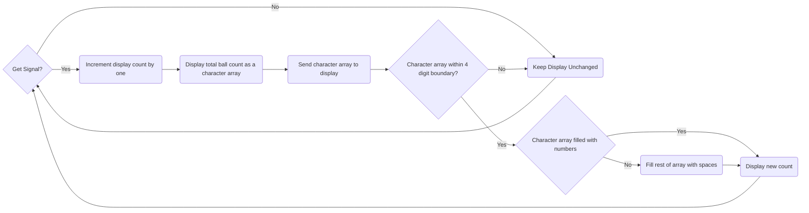

# Detailed Design for Counting Display

## Function of the Counting Display Subsystem

The Counting Display Systems section shall implement a LCD Display that will display the amount of collected tennis balls.

## Specifications and Constraints

- The LCD display shall use Serial Communication to communicate with the Counting Sensor and Raspberry Pi components.
  - Rationale: There should be a common communication method between subsystems 
- The subsystem shall display an accurate account of collected balls throughout the entire collection process.
  - Rationale: The counting display subsystem will work in correlation with the Counting sensor subsystem in order for the project design to fulfill its goal of an accurate tennis ball collector.
- The LCD display shall be connected to a circuit that supplies the required voltage of approximately 3.3V to the LCD display.
  - Rationale: The raspberry pi model 4 B supplies 3.3V from its GPIO pins which will be used to interface with the solutions proposed by the counting display subsystem.

## Overview of Proposed Solution

This subsystem shall display the amount of tennis balls collected as a numerical value. This subsystem also encompasses coding scripts that will interface with the LCD display. There are multiple solutions examined in this detailed design. One involves altering the LCD display to [3] used for convience with existing data online about interfacing the LCD display with the raspberry pi model 4 B. Another solution involves using [7] with a soldered I2C LCD adapter connected to a I2C logic level convertor to adequatly supply the different LCD display from the proposed conceptual design LCD. The final solution is integrating the LCD [1] from the conceptual design similar to solution 1 but with little to no knowledge on encoding the raspberry pi model 4 B to work with [1]

## Interface with Other Subsystems

All three solutions involve using serial communication to interface with the raspberry pi model 4 B. Solution 1 has a serial mode that is able to be utilized in the design. Solution 2 converts serial data to characters that can be displayed on the LCD display. Solution 3 has a dedicated serial input and serial clock to integrate with raspberry pi model 4 B pins. 

## 3D Model of Custom Mechanical Components

There are no mechanical components in this subsystem.

## Buildable Schematic 

Integrate a buildable electrical schematic directly into the document. If the diagram is unreadable or improperly scaled, the supervisor will deny approval. Divide the diagram into sections if the text and components seem too small.

The schematic should be relevant to the design and provide ample details necessary for constructing the model. It must be comprehensive so that someone, with no prior knowledge of the design, can easily understand it. Each related component's value and measurement should be clearly mentioned.

## Printed Circuit Board Layout
### Solution 1

## Operational Flowchart

## BOM
# Solution 1
| Manufacturer | Product Number | Distributor | Distributor Part number | Quantity | Price | Purchase Link |
|--------------|----------------|-------------|-------------------------|----------|-------|---------------|
| Display Visions | EA DOGM162W-A | DigiKey | 1481-1078-ND | 1 | $13.53 | [link](https://www.digikey.com/en/products/detail/display-visions/EA-DOGM162W-A/4896717?s=N4IgTCBcDaIKIEEAEARA8gcQLIEYBsYA6gLQIgC6AvkA) |

# Solution 2
| Manufacturer | Product Number | Distributor | Distributor Part number | Quantity | Price | Purchase Link |
|--------------|----------------|-------------|-------------------------|----------|-------|---------------|
| Hitachi | HD44780U | Sparkfun | 255 | 1 | $18.50 | [link](https://www.sparkfun.com/products/255) |
| ‎HiLetgo | 3-01-0080 | Amazon | B00VC2NEU8 | 2 | $7.49 | [link](https://www.amazon.com/HiLetgo-Interface-LCD1602-Address-Changeable/dp/B00VC2NEU8/ref=sr_1_1_sspa?crid=GSVG5X7RN5SX&dib=eyJ2IjoiMSJ9.KForF0owAe67XDG8YMDcsuzS7CDsUVcarAAwGx7y-8joyOKXOP82yKPC3BRftVG7Y56jeGSHTY2G2BdsG-MFFbj4-LbR_qLrCxvdBFXNIyV7bPMyKhoZJ_Wpfg-gvq4MWuIqCbPxy--wVuZF7YwpYzVMD9TGTUoGPfztdTx2K3ju6s-zMCp0ehPBoSC1OzrthkXCFS-8iwfQqZuxpc3NNozA3jtkURhnY_DkdMbeuyA.nNS47jSYa7aOu31ZXzhw7lTPkdU6fevkL9TMrl_h0hI&dib_tag=se&keywords=i2c+lcd+adapter&qid=1732507815&sprefix=i2c+lcd+adapter%2Caps%2C113&sr=8-1-spons&sp_csd=d2lkZ2V0TmFtZT1zcF9hdGY&psc=1) |
| Adafruit | 757 | Adafruit | 757 | 1 | $3.95 | [link](https://www.adafruit.com/product/757) |

# Solution 3
| Manufacturer | Product Number | Distributor | Distributor Part number | Quantity | Price | Purchase Link |
|--------------|----------------|-------------|-------------------------|----------|-------|---------------|
| Display Visions | EA DOGM132L-5 | DigiKey | 1481-1071-ND | 1 | $13.53 | [link](https://www.digikey.com/en/products/detail/display-visions/EA-DOGM162W-A/4896717?s=N4IgTCBcDaIKIEEAEARA8gcQLIEYBsYA6gLQIgC6AvkA) |

## Analysis

According to the Bill of Materials, there were 3 possible solutions examined for this subsystem. The purpose of these solutions is to provide a guideline to construct the subsystem to work with the specifications and constraints given for the project and this subsystem. Solution number one is to alter the component being used from [1] to [3]. A example of the potential source code using this design is implemented in [5]. One reason not to use this solution is the difficulty of implementation. This solution involves writing the driver to interface from the raspberry pi 4 model B to the DOGM162W-A. The second solution has an easier integration but costs more. This involves soldering a I2C LCD adapter to [7], connecting the component to a I2C logic level converter, then connecting the I2C logic level converter to gpio pins of the subsystem. This solution involves simplier coding integration, see [6], with other subsystems including the Counting Sensor, and RC subsystems. The final solution is to keep the sensor unchanged from the conceptual design and rewriting the driver with more points for error in the design. The solutions were ordered based on a combination of cost and ease of integration with the project design and other subsystems.   

## References

[1] "EA DOGM132L-5," DigiKey Electronics, <https://www.digikey.com/en/products/detail/display-visions/EA-DOGM132L-5/4896710> (accessed Nov. 4, 2024). 

[2] "DOGM132 GRAPHIC,"  DigiKey Electronics, <https://www.lcd-module.de/eng/pdf/grafik/dogm132-5e.pdf> (accessed Nov. 19, 2024).

[3] "EA DOGM162W-A," DigiKey Electronics, <https://www.digikey.com/en/products/detail/display-visions/EA-DOGM162W-A/4896717?s=N4IgTCBcDaIKIEEAEARA8gcQLIEYBsYA6gLQIgC6AvkA> (accessed Nov. 24, 2024).

[4] "DOG series 3.3V," DigiKey Electronics, <https://www.lcd-module.de/eng/pdf/doma/dog-me.pdf> (accessed Nov. 24, 2024).

[5] "ST7036_EA_DOGM_Python_driver_plain.py" <https://www.lcd-module.com/fileadmin/html-seiten/deu/disk/development-service/Raspberry/ST7036_EA_DOGM_Python_driver_plain.py> (accessed Nov. 23, 2024).

[6] "Control a HD44780 LCD display via I2C with the Raspberry Pi" <https://tutorials-raspberrypi.com/control-a-raspberry-pi-hd44780-lcd-display-via-i2c/> (accessed Nov. 23, 2024).

[7] "Basic 16x2 Character LCD - Black on Green," Sparkfun, <https://www.sparkfun.com/products/255> (accessed Nov. 24, 2024).

[8] "HD44780U (LCD-II)," Sparkfun, <https://www.sparkfun.com/datasheets/LCD/HD44780.pdf> (accessed Nov. 24, 2024).

[9] "Arduino Display Interface" Amazon, <https://www.amazon.com/JANSANE-Arduino-Display-Interface-Raspberry/dp/B07D83DY17/ref=sr_1_18?adgrpid=1340305246769769&dib=eyJ2IjoiMSJ9.KForF0owAe67XDG8YMDcslAoBQE-22v5eSGkrAqNaagka8eYdQFb4Inb_TGtD3NxRcDPTJZMwSl3CCEAoDZkLUL7VGEIqbh7dUtcCLQ7RcQPL0_MUAk80VSzdCEG6yt1_8VDvR9V8bamJIndqjU6v2sHOYExJck5NwHhn5nhua3RWxtZPgSW2uHkna4ojTbBaIf_B9q1EfGQs1Y-IgaQ89n7GYYjCOpJBfbYZhWxWdI.VB7rdWt6ogCv0fKAzrzrQZ7aP5_I1_HFryDEM8fUEpU&dib_tag=se&hvadid=83769464201946&hvbmt=be&hvdev=c&hvlocphy=84181&hvnetw=o&hvqmt=e&hvtargid=kwd-83769441278522%3Aloc-190&hydadcr=24660_13770028&keywords=i2c+lcd+adapter&msclkid=302b2dd59fb41237af8b4a96e06373ae&qid=1732476931&sr=8-18> (accessed Nov. 24, 2024).

[10] "I2C logic level converter" Adafruit, <https://www.adafruit.com/product/757> (accessed Nov. 24, 2024).
