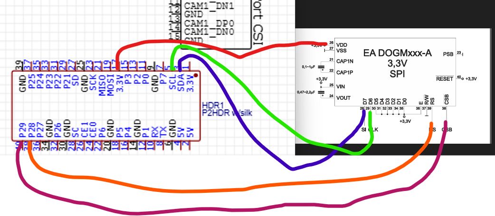
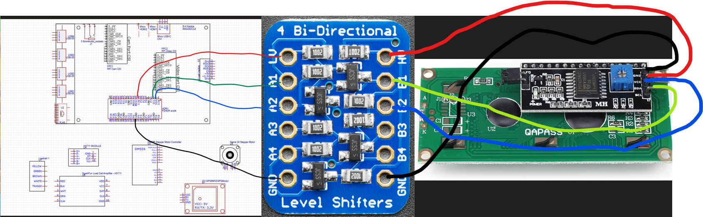
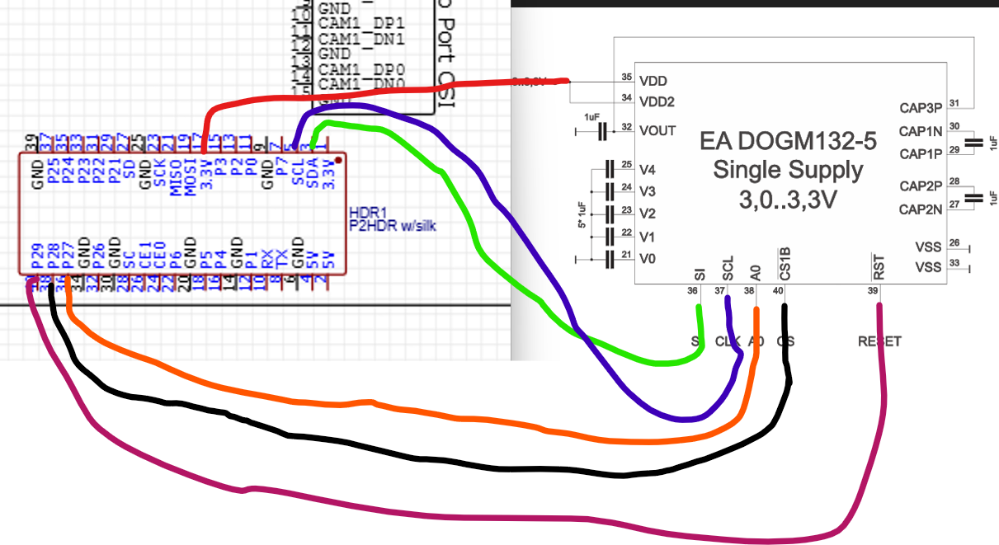
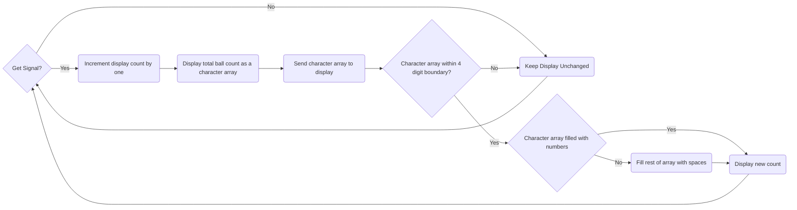

# Detailed Design for Counting Display

## Function of the Counting Display Subsystem

The Counting Display subsystem shall implement a LCD Display that will display the amount of collected tennis balls. This subsystem will interpret every new reading from the Counting Sensor subsystem as a new tennis ball. For every new tennis ball detected by the sensor, the counting display subsystem will increment the number displayed on the LCD display. The LCD display shall output the information to the user in a comprehensive way such as "The number of Tennis Balls collected is #", where # is the number of tennis balls collected. 

## Specifications and Constraints

- The LCD display shall use Serial Communication to communicate with the Counting Sensor and Raspberry Pi components.
  - Rationale: There should be a common communication method between subsystems 
- The subsystem shall display an accurate account of collected balls throughout the entire collection process.
  - Rationale: The counting display subsystem will work in correlation with the Counting sensor subsystem in order for the project design to fulfill its goal of an accurate tennis ball collector.
- The LCD display shall be connected to a circuit that supplies the required voltage of approximately 3.3V to the LCD display.
  - Rationale: The raspberry pi model 4 B [1] supplies 3.3V from its GPIO pins which will be used to interface with the solutions proposed by the counting display subsystem.
- The counting display shall use materials and components that comply with Restriction of Hazardous Substances (RoHS) standards.
  - Rationale: Compliance with RoHS standards minimizes the use of hazardous materials in electronic components, promoting environmental safety and ethical responsibility in the product's lifecycle. This aligns with the U.S Hazardous Materials Regulations ethical constraint as specified in the conceptual design.

## Overview of Proposed Solution

This subsystem shall display the amount of tennis balls collected as a numerical value. This subsystem also encompasses coding scripts that will interface with the LCD display. There are multiple solutions examined in this detailed design. One involves altering the LCD display to the EA DOGM162W-A [1] used for convience with existing data online about interfacing the LCD display with the raspberry pi model 4 B [1]. Another solution involves using a HD44780U [3] with a soldered I2C LCD adapter [4] connected to a I2C logic level converter [5] to adequatly supply the different LCD display from the proposed conceptual design LCD. The final solution is integrating the EA DOGM132L-5 [6] from the conceptual design similar to solution 1 but with little to no knowledge on encoding the raspberry pi model 4 B [1] to work with the DOGM132L-5 [6].

## Interface with Other Subsystems

All three solutions involve using serial communication to interface with the raspberry pi model 4 B [1]. Solution 1 has a serial mode that is able to be utilized in the design. Solution 2 converts serial data to characters that can be displayed on the LCD display. Solution 3 has a dedicated serial input and serial clock to integrate with raspberry pi model 4 B pins. The Counting Sensor subsystem also uses serial communication providing a communication method between the two subsystems. The communication between the sensor and display subsystems works as follows: when the sensor [7] detects a new tennis ball, the display is incremented by one. The power subsystem was designed so that the required current is supplied for solutions 1 and 3 and the required voltage is supplied to the raspberry pi model 4 B [1]. Solution 2 accounts for power with the I2C logic level converter [5].

## 3D Model of Custom Mechanical Components

There are no mechanical components in this subsystem.

## Buildable Schematic / Printed Circuit Board Layout
### Solution 1

### Solution 2

### Solution 3

## Operational Flowchart

## BOM
# Solution 1
| Manufacturer | Product Number | Distributor | Distributor Part number | Quantity | Price | Purchase Link | Datasheet |
|--------------|----------------|-------------|-------------------------|----------|-------|---------------|-----------|
| Display Visions | EA DOGM162W-A | DigiKey | 1481-1078-ND | 1 | $13.53 | [link](https://www.digikey.com/en/products/detail/display-visions/EA-DOGM162W-A/4896717?s=N4IgTCBcDaIKIEEAEARA8gcQLIEYBsYA6gLQIgC6AvkA) | [8](https://www.lcd-module.de/eng/pdf/doma/dog-me.pdf) |

# Solution 2
| Manufacturer | Product Number | Distributor | Distributor Part number | Quantity | Price | Purchase Link | Datasheet |
|--------------|----------------|-------------|-------------------------|----------|-------|---------------|-----------|
| Hitachi | HD44780U | Sparkfun | 255 | 1 | $18.50 | [link](https://www.sparkfun.com/products/255) | [9](https://www.sparkfun.com/datasheets/LCD/HD44780.pdf) |
| ‎HiLetgo | 3-01-0080 | Amazon | B00VC2NEU8 | 2 | $7.49 | [link](https://www.amazon.com/HiLetgo-Interface-LCD1602-Address-Changeable/dp/B00VC2NEU8/ref=sr_1_1_sspa?crid=GSVG5X7RN5SX&dib=eyJ2IjoiMSJ9.KForF0owAe67XDG8YMDcsuzS7CDsUVcarAAwGx7y-8joyOKXOP82yKPC3BRftVG7Y56jeGSHTY2G2BdsG-MFFbj4-LbR_qLrCxvdBFXNIyV7bPMyKhoZJ_Wpfg-gvq4MWuIqCbPxy--wVuZF7YwpYzVMD9TGTUoGPfztdTx2K3ju6s-zMCp0ehPBoSC1OzrthkXCFS-8iwfQqZuxpc3NNozA3jtkURhnY_DkdMbeuyA.nNS47jSYa7aOu31ZXzhw7lTPkdU6fevkL9TMrl_h0hI&dib_tag=se&keywords=i2c+lcd+adapter&qid=1732507815&sprefix=i2c+lcd+adapter%2Caps%2C113&sr=8-1-spons&sp_csd=d2lkZ2V0TmFtZT1zcF9hdGY&psc=1) | Not given |
| Adafruit | 757 | Adafruit | 757 | 1 | $3.95 | [link](https://www.adafruit.com/product/757) | Not given |

# Solution 3
| Manufacturer | Product Number | Distributor | Distributor Part number | Quantity | Price | Purchase Link | Datasheet |
|--------------|----------------|-------------|-------------------------|----------|-------|---------------|-----------|
| Display Visions | EA DOGM132L-5 | DigiKey | 1481-1071-ND | 1 | $13.53 | [link](https://www.digikey.com/en/products/detail/display-visions/EA-DOGM162W-A/4896717?s=N4IgTCBcDaIKIEEAEARA8gcQLIEYBsYA6gLQIgC6AvkA) | [10](https://www.lcd-module.de/eng/pdf/grafik/dogm132-5e.pdf) |

## Analysis

According to the Bill of Materials, there were 3 possible solutions examined for this subsystem. The purpose of these solutions is to provide a guideline to construct the subsystem to work with the specifications and constraints given for the project and this subsystem. Only one solution will be implemented in the final design which will be solution 3.  Solution three does not change the component being used which is the EA DOGM132L-5 [6] from the conceptual design. This component requires 3.3 V according to the datasheet [10]. The functional voltage for the LCD display [6] is addressed through the 3.3 V supplied by circuit constraint. Existing source code [11] implementing the EA DOGM162W-A [2] can be used as guidance for constructing the driver to interface with the EA DOGM132L-5 [6] using the raspberry pi model 4 B [1]. The DOGM132L-5 [6] has a serial data in pin and a serial clock pin that is used for serial communication which complies with the Serial Communication constraint. The communication between the Counting Sensor subsystem and the Counting Display Subsystem will work as follows to address the accurate tennis ball collector constraint. When the sensor [7] detects a new tennis ball, the implemented code will increment the number of tennis balls by one and write the new number to the LCD display [6]. The only component in the counting display subsystem to worry about Restriction of Hazardous Substances (RoHS) compliance, which is a constraint for this subsystem, is the DOGM132L-5 [6]. The component is compliant with RoHS3 as given in the Environmental and Exports Section on the Digikey order website for the DOGM132L-5 [6].  

## References

[1] A. Industries, “Raspberry pi 4 model B - 2 GB RAM,” adafruit industries blog RSS, <https://www.adafruit.com/product/4292#description> (accessed Nov. 4, 2024).

[2] "EA DOGM162W-A," DigiKey Electronics, <https://www.digikey.com/en/products/detail/display-visions/EA-DOGM162W-A/4896717?s=N4IgTCBcDaIKIEEAEARA8gcQLIEYBsYA6gLQIgC6AvkA> (accessed Nov. 24, 2024).

[3] "Basic 16x2 Character LCD - Black on Green," Sparkfun, <https://www.sparkfun.com/products/255> (accessed Nov. 24, 2024).

[4] "JANSANE 16x2 1602 LCD Display Screen Blue + IIC I2C Module Interface Adapter for Raspberry pi 2 Pack", Amazon, <https://www.amazon.com/JANSANE-Arduino-Display-Interface-Raspberry/dp/B07D83DY17/ref=sr_1_18?adgrpid=1340305246769769&dib=eyJ2IjoiMSJ9.KForF0owAe67XDG8YMDcslAoBQE-22v5eSGkrAqNaagka8eYdQFb4Inb_TGtD3NxRcDPTJZMwSl3CCEAoDZkLUL7VGEIqbh7dUtcCLQ7RcQPL0_MUAk80VSzdCEG6yt1_8VDvR9V8bamJIndqjU6v2sHOYExJck5NwHhn5nhua3RWxtZPgSW2uHkna4ojTbBaIf_B9q1EfGQs1Y-IgaQ89n7GYYjCOpJBfbYZhWxWdI.VB7rdWt6ogCv0fKAzrzrQZ7aP5_I1_HFryDEM8fUEpU&dib_tag=se&hvadid=83769464201946&hvbmt=be&hvdev=c&hvlocphy=84181&hvnetw=o&hvqmt=e&hvtargid=kwd-83769441278522%3Aloc-190&hydadcr=24660_13770028&keywords=i2c+lcd+adapter&msclkid=302b2dd59fb41237af8b4a96e06373ae&qid=1732476931&sr=8-18> (accessed Nov. 24, 2024).

[5] "4-channel I2C-safe Bi-directional Logic Level Converter", Adafruit, <https://www.adafruit.com/product/757> (accessed Nov. 24, 2024).

[6] "EA DOGM132L-5," DigiKey Electronics, <https://www.digikey.com/en/products/detail/display-visions/EA-DOGM132L-5/4896710> (accessed Nov. 4, 2024). 

[7] "MakerFocus TFmini-s Micro Lidar Module 0.1-12M Lidar Range Finder Sensor Obstacle Avoidance Sensor Tiny Module Single Point UART I2C IO Compatible with Pixhawk Ar duino and Raspberry Pi", Amazon, <https://www.amazon.com/MakerFocus-Single-Point-Ranging-Pixhawk-Compatible/dp/B075V5TZRY/ref=sr_1_2?crid=RGIY8KZGSW94&dib=eyJ2IjoiMSJ9.q0fFSRp2NhjCPqdb-Ue0i7CoA6Vjynedthwi1KQXkKrlI3G9wrmLYCtiq8KhXhkZhhPya9U999be-mDQLFqGlix2eyKUzCFZoxq0siO5wXBa4j_DJcigfOTADGIpkvT9s814A6TIJhGIseVpZPmMWRpIDnq91KjIy4Nzsugp3PXzrzY0zwerakqIOaFCtsSsrnCO1XelzBIUc0tfBQe3Z5roGyOxJ89btKSK9_rITPAGML-LtM8Ogm_KJvlnLcKj7frO2tlzCq0L3rS-0o80T9I_0sC5wp7yMVUCSnafmfg.YBJg9rlZiPPqHxD4KH8F_piWeG3_B6xFcRsBRwg9CcA&dib_tag=se&keywords=MakerFocus+Lidar+Range+Finder+Sensor+Module+Single-Point+Micro+Ranging+Module+Compatible+with+Pixhawk%2C+Arduino+with+UART+Communication+Interface&qid=1730931566&s=industrial&sprefix=makerfocus+lidar+range+finder+sensor+module+single-point+micro+ranging+module+compatible+with+pixhawk%2C+arduino+with+uart+communication+interface%2Cindustrial%2C87&sr=1-2-catcorr> (accessed Dec. 2, 2024).

[8] "DOG series 3.3V," DigiKey Electronics, <https://www.lcd-module.de/eng/pdf/doma/dog-me.pdf> (accessed Nov. 24, 2024).

[9] "HD44780U (LCD-II)," Sparkfun, <https://www.sparkfun.com/datasheets/LCD/HD44780.pdf> (accessed Nov. 24, 2024).

[10] "DOGM132 GRAPHIC,"  DigiKey Electronics, <https://www.lcd-module.de/eng/pdf/grafik/dogm132-5e.pdf> (accessed Nov. 19, 2024).

[11] "ST7036_EA_DOGM_Python_driver_plain.py" <https://www.lcd-module.com/fileadmin/html-seiten/deu/disk/development-service/Raspberry/ST7036_EA_DOGM_Python_driver_plain.py> (accessed Nov. 23, 2024).

