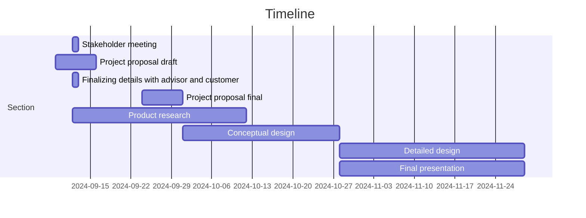

# Tennis Ball Collector

## Team 3

ECE 4961-001 

 

### Introduction 

Tennis is a time-honored game that can be dated back to the 11th century, played by all ages all around the world. When you think of tennis you think of the intense competition, the player’s personalities, and the feeling in the of your favorite team winning. What is not talked about however is the cleanup process, after an intense match there is a lot of preparation that goes into getting the next match ready. When consulting the customer, they explained that their current tennis ball collecting method was outdated and broken. The main objective of this Capstone Design is to make an autonomous Tennis Ball Collector that can provide an effective alternative to this cleanup process.  

 

### Formulating the Problem 

Collecting Tennis Balls at the end of a long day at practice is a daunting task for players who have been running for hours on end. Having to go and pick up each ball one by one is not only a waste of the players' time, but energy as well. To aid in this task, companies have created push devices that collect balls into a cart. While these devices provided a solution to the bigger problem, they raised concerns for more. After taking in many tennis balls, these machines can jam, halting the process. Along with that, these devices can move for their given purpose but cannot be easily transported from court to court. With teams having indoor and outdoor courts at different locations this is crucial.  

 

### Specifications and Constraints 

Specifications 

1. The revised model of the tennis ball collector shall fulfill the duty of collecting and managing 50-100 balls at a time.  

2. The product shall be operational year-round and be versatile on both indoor and outdoor tennis courts.  

3. The product shall be easy to carry for a single person with two hands including modifications.  

4. The product shall be cost-efficient with costs no more than 33% more than the customer’s alternative option, Playmate’s ball mower valued at $695.

5. The robot shall be autonomous with the ability to interact with its environment including human interaction posing little interference with ongoing activities within operating range.

Constraints

1. UL 3100 section 6.1 - If the robot utilizes a charging port, the robot shall not be capable of being energized in a manner that would allow movement of the system that would strain connections to the charger or cause the connection to break.

2. IEEE Global Initiative on Ethics of Autonomous and Intelligent Systems Principle 5 (Transparency) - The robot shall have a “why did you do that button” which, when pressed, causes the robot to explain the action it just took. This is done to identify preventative hazards including unsafe behavior to humans or property.

### Survey of Solutions 

The tennis ball collector will be a manual, user-friendly tool enhanced with sensors, foldability, and improved mechanical features. It will be an updated tennis ball collector that the Tennessee Tech Tennis team currently uses. Unlike autonomous collectors on the market—which can cover entire clay courts, including hard-to-reach areas like the net, fence, and corners, but often cost upwards of $3,000—this collector will remain budget-friendly and accessible. Tennis is already a costly sport, and high expenses for equipment like ball collectors add an unnecessary financial burden. While there are various manual ball mowers available, the current model used by the team faces limitations related to court type, ball capacity, and weight, and even the most recent models can be too costly for school budgets. This redesign will address these issues by enhancing the team’s existing collector to make it easier to use and transport without the need for full autonomy, making tennis practice more efficient without adding significant expense.  

 
### Unknown obstacles 

The process of customizing computer chips for design and having the hardware behave functionally as expected. 

Response of the autonomous vehicle to obstacles such as poles, fences, other balls, and human interference. 

Response of the autonomous vehicle to differing weather conditions including but not limited to heavy rainfall, snow, and thunderstorms. 

Response of the autonomous vehicle to electromagnetic interference brought by other devices or external sources. 

### Measure of Success 

The project shall build upon the already established tennis ball collector used by Tennessee Tech. The project shall enhance the ball collector by adding a counter to ensure complete collection of balls, add a vibrating function to eliminate blockage, and add hinges to help with the mobility on different terrain.

### Broader Implications/Ethics 
This project will act as a means of improving the current tennis team’s training efficiency, device accessibility, and facility maintenance. Globally, considering the demand for this product, it could contribute to resource depletion. Economically, this product could save TN Tech funding as we are modifying the existing model instead of purchasing a new one. From an environmental perspective, the process of designing our product could contribute to global waste and energy consumption. Socially, this product could create disparities between well-funded sports facilities and underprivileged communities. We are adament to developing a solution that is within health and safety regulations,  mindful of resource usage.  

### Resources 

To make a cost-effective, portable, remote controlled tennis ball collector efficient, it will take a solid understanding of remote controls and RF and knowledge of parts necessary for the robot. A processor that can handle multiple sensors such as infrared is needed for this robot. Lab equipment such as oscilloscopes and computers to interface with the processor will be needed. It is expected that it will take $1,000 dollars for prototyping to get the desired results. This number comes from the cost of all components mentioned above plus some extra because components may become damaged while working with them. This number comes from the cost of some components being added together with a small amount of overhead. Some of the more expensive components are the battery and charger which will range somewhere between $100-200 for a lithium-ion battery with high capacity, a raspberry-pi 5 is $80 dollars and we will also need a case and cables for it, and other various sensors together will cost around $200 dollars. This number will not be passed due to the individual components being used for prototyping being inexpensive for the most part. On top of prototyping costs, funding will be needed for CAD softwares and creating the finished build which will add at least $500 dollars based on softwares currently on the market so $1,500 will be enough to meet the customer’s needs.
 

### Personnel 

Carter Brady- Has worked with autonomous vehicle simulations including ROS. Has strong software background. 

Gabriel Dubose- Experience in working microcomputer processing, digital systems, Arduino coding  

Cindy Escobar- Experienced with object-oriented programming, a little RANCS autonomous vehicle programming, microcomputing, and digital systems. 

Tate Finley- Experienced with C/C++, Schematic design, and interest in recursive neural networks.  

Ashli Watkins- Previous work in object-oriented programming, computer networking, and circuit design/wiring 

Maxwell Wynne- Has experience with languages C/C++, python, and assembly. Also has experience with microcomputing and algorithms. 

 

### Timeline 

Initial meeting with stakeholder 09/12, declaring the first set of draft specifications 

Project Proposal Draft expected to be completed by September 16th 

Finalizing details with advisors and customers for proposal 

Project Proposal Final expected to be completed by September 30th 

Researching components that can be used for the design. 

Conceptual Design expected to be completed by October 28th 

Verifying theories of implementation of software and design with advisor and customer. 

Detailed Design expected to be completed by November 30th 

Final Presentation expected to be completed by November 30th 

The project will be done with the project by May 25th, 2025 

### Contributions 

Carter Brady – Worked on resources, personnel, and timeline 

Maxwell Wynne – Worked on formulating the problem, personnel, and timeline 

Gabriel Dubose - Worked on Introduction, personnel, and timeline 

Tate Finley – Worked on sections ‘summarizing the problem,’ and ‘looking down the path to success’ including subsections. 

Ashli Watkins- Specification and Contributions, Timeline 

Cindy Escobar- Survey of Solutions, Personnel, Timeline 

 
