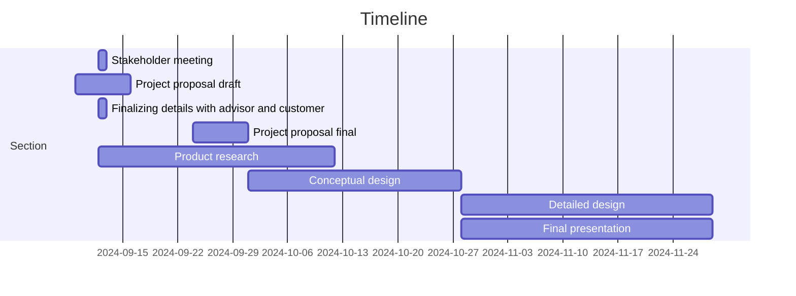

# Tennis Ball Collector

## Team 3

ECE 4961-001 

 

### Introduction 

Tennis is a time-honored game that can be dated back to the 11th century, played by all ages all around the world. When you think of tennis you think of the intense competition, the player’s personalities, and the feeling in the of your favorite team winning. What is not talked about however is the cleanup process, after an intense match there is a lot of preparation that goes into getting the next match ready. When consulting the customer, they explained that their current tennis ball collecting method was outdated and broken. The main objective of this Capstone Design is to make an autonomous Tennis Ball Collector that can provide an effective alternative to this cleanup process.  

 

### Formulating the Problem 

Collecting Tennis Balls at the end of a long day at practice is a daunting task for players who have been running for hours on end. Having to go and pick up each ball one by one is not only a waste of the players' time, but energy as well. To aid in this task, companies have created push devices that collect balls into a cart. While these devices provided a solution to the bigger problem, they raised concerns for more. After taking in many tennis balls, these machines can jam, halting the process. Along with that, these devices can move for their given purpose but cannot be easily transported from court to court. With teams having indoor and outdoor courts at different locations this is crucial.  

 

### Specifications and Constraints 

Our stakeholder desires an operating model of tennis ball collector that is autonomous in collecting and managing 50-100 balls at a time and capable of operation year-round. The product should be versatile on both indoor and outdoor tennis courts. Initiating at a user input, but self-functioning in execution. When comparing to the competitors, Tennibot and Playmate’s Ball-Mower, our product remains effective in usage while being lightweight, compact, and cost efficient.  

 

 

 

### Survey of Solutions 

On the market, there is a robotic tennis ball collector that collects balls on clay courts, on the entire court including the net, fence, and corners, and it weighs approximately 25 lbs. Yet not everyone can attain one unless they have roughly $3,000 to afford it. Tennis is already an expensive sport that should not require additional spending to pick up tennis balls. There are other manual tennis ball collectors, like the machine the Tennessee Tech Tennis team is using. The issue, as previously stated, is limited to the kind of court, the number of tennis balls it can collect, and the weight of the big tennis ball mower. Also, depending on which manual mower, the price can vary, and our school cannot even purchase a recent mower.  

 

### Summarizing the Problem 

 

### Looking Down the Path Toward Solution 

 

### Unknown obstacles 

The process of customizing computer chips for design and having the hardware behave functionally as expected. 

Response of the autonomous vehicle to obstacles such as poles, fences, other balls, and human interference. 

Response of the autonomous vehicle to differing weather conditions including but not limited to heavy rainfall, snow, and thunderstorms. 

Response of the autonomous vehicle to electromagnetic interference brought by other devices or external sources. 

### Measure of Success 

The customer is satisfied with the final product or progression toward the final product. 

The device has some working autonomous features (no human intervention or involvement) 

The device fulfills the duties of a tennis ball collector. 

The device is able to withstand all types of mild weather conditions preserving the functionality of the autonomous vehicle for a substantial amount of time. 

The innerworkings of the device are able to be easily accessible to fix hardware issues or software bugs. 

### Broader Implications/Ethics 

This vehicle should also have the option to become a manual for the customer’s stakeholders (Tennis Team) so that the vehicle will not replace their responsibilities. 

 

### Resources 

To make a cost-effective, portable, remote controlled tennis ball collector efficient, it will take a solid understanding of remote controls and RF and knowledge of parts necessary for the robot. A processor that can handle multiple sensors such as infrared is needed for this robot. Lab equipment such as oscilloscopes and computers to interface with the processor will be needed. It is expected that it will take $1,000 dollars for prototyping to get the desired results. This number will not be passed due to the individual components being used for prototyping being cheap. On top of prototyping costs, funding will be needed for CAD software and creating the finished build therefore $2,000 dollars shall be enough to meet the customer’s needs. 
 

### Personnel 

Carter Brady- Has worked with autonomous vehicle simulations including ROS. Has strong software background. 

Gabriel Dubose- Experience in working microcomputer processing, digital systems, Arduino coding  

Cindy Escobar- Experienced with object-oriented programming, a little RANCS autonomous vehicle programming, microcomputing, and digital systems. 

Tate Finley- Experienced with C/C++, Schematic design, and interest in recursive neural networks.  

Ashli Watkins- Previous work in object-oriented programming, computer networking, and circuit design/wiring 

Maxwell Wynne- Has experience with languages C/C++, python, and assembly. Also has experience with microcomputing and algorithms. 

 

### Timeline 

Initial meeting with stakeholder 09/12, declaring the first set of draft specifications 

Project Proposal Draft expected to be completed by September 16th 

Finalizing details with advisors and customers for proposal 

Project Proposal Final expected to be completed by September 30th 

Researching components that can be used for the design. 

Conceptual Design expected to be completed by October 28th 

Verifying theories of implementation of software and design with advisor and customer. 

Detailed Design expected to be completed by November 30th 

Final Presentation expected to be completed by November 30th 

The project will be done with the project by May 25th, 2025 

### Contributions 

Carter Brady – Worked on resources, personnel, and timeline 

Maxwell Wynne – Worked on formulating the problem, personnel, and timeline 

Gabriel Dubose - Worked on Introduction, personnel, and timeline 

Tate Finley – Worked on sections ‘summarizing the problem,’ and ‘looking down the path to success’ including subsections. 

Ashli Watkins- Specification and Contributions, Timeline 

Cindy Escobar- Survey of Solutions, Personnel, Timeline 

 
