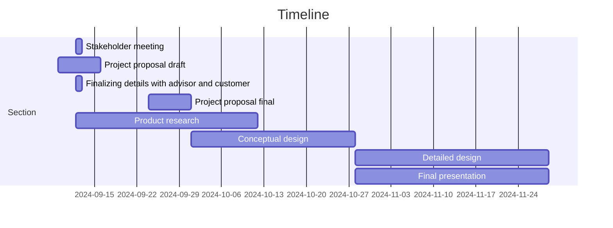

# Tennis Ball Collector

## Team 3

ECE 4961-001 

 

### Introduction 

Tennis is a time-honored game that can be dated back to the 11th century, played by all ages all around the world. When you think of tennis you think of the intense competition, the player’s personalities, and the feeling in the of your favorite team winning. What is not talked about however is the cleanup process, after an intense match there is a lot of preparation that goes into getting the next match ready. When consulting the customer, they explained that their current tennis ball collecting method was outdated and broken. The main objective of this Capstone Design is to make an autonomous Tennis Ball Collector that can provide an effective alternative to this cleanup process.  

 

### Formulating the Problem 

Collecting Tennis Balls at the end of a long day at practice is a daunting task for players who have been running for hours on end. Having to go and pick up each ball one by one is not only a waste of the players' time, but energy as well. To aid in this task, companies have created push devices that collect balls into a cart. While these devices provided a solution to the bigger problem, they raised concerns for more. After taking in many tennis balls, these machines can jam, halting the process. Along with that, these devices can move for their given purpose but cannot be easily transported from court to court. With teams having indoor and outdoor courts at different locations this is crucial.  

 

### Specifications and Constraints 

Specifications 

1. The revised model of the tennis ball collector shall fulfill the duty of collecting and managing 50-100 balls at a time.  

2. The product shall be versatile on both indoor and outdoor tennis courts.  

3. The device shall operate year-round on rainy or dry courts. 

4. The product shall remain operational after a duration of time while being easy to carry including modifications.  

5. The product shall be cost-efficient with costs no more than 33% more than the customer’s alternative option, Playmate’s ball mower valued at $695.   

Standards

IEEE 802.15.1 -- This IEEE standard details bluetooth specifications for wireless communication of low energy consumption requirement devices. Assuming a battery powered remote controller connecting to a microprocessor within the modified tennis ball collector, this mechanism fits the low energy consumption requirement for this specification. 

IEEE 802.11 -- This IEEE standard details the wireless LAN standard used for communication between two devices. This standard relates to the design of the modified tennis ball collector because of the wireless communication between the remote controller and the ball collector. This standard limits the frequency band able to be used for communication. 

 

### Survey of Solutions 

On the market, there is a robotic tennis ball collector that collects balls on clay courts, on the entire court including the net, fence, and corners, and it weighs approximately 25 lbs. Yet not everyone can attain one unless they have roughly $3,000 to afford it. Tennis is already an expensive sport that should not require additional spending to pick up tennis balls. There are other manual tennis ball collectors, like the machine the Tennessee Tech Tennis team is using. The issue, as previously stated, is limited to the kind of court, the number of tennis balls it can collect, and the weight of the big tennis ball mower. Also, depending on which manual mower, the price can vary, and our school cannot even purchase a recent mower.  

 

### Summarizing the Problem 

 

### Looking Down the Path Toward Solution 

 

### Unknown obstacles 

The process of customizing computer chips for design and having the hardware behave functionally as expected. 

Response of the autonomous vehicle to obstacles such as poles, fences, other balls, and human interference. 

Response of the autonomous vehicle to differing weather conditions including but not limited to heavy rainfall, snow, and thunderstorms. 

Response of the autonomous vehicle to electromagnetic interference brought by other devices or external sources. 

### Measure of Success 

The project shall build upon the already established tennis ball collector used by Tennessee Tech.  With consecutive testing of these 3 designs, the project shall be deemed successful: 

1. For compact effectiveness and mobility, the customer shall test the mobility by having the project being used during practice. 

2. For transparency of cost, the customer shall compare the costs of the project to the cost of replacing equipment. 

### Broader Implications/Ethics 

This project will act as a means of improving the current tennis team’s training efficiency, device accessibility, and facility maintenance.   

In reference to the IEEE Code of Ethics, the tennis ball collection project team ennobles a high ethical and professional conduct by: 

1. Actively strategize an ethical solution, executing it in a sustainable manner.  

2. Maintain a product produced from the latest of our technical competence in pursuit of improving the common good in the tennis community. 

3. Establish a constant tenacity concerning the development of our product secured in expansive knowledge and notion. 

### Resources 

To make a cost-effective, portable, remote controlled tennis ball collector efficient, it will take a solid understanding of remote controls and RF and knowledge of parts necessary for the robot. A processor that can handle multiple sensors such as infrared is needed for this robot. Lab equipment such as oscilloscopes and computers to interface with the processor will be needed. It is expected that it will take $1,000 dollars for prototyping to get the desired results. This number comes from the cost of all components mentioned above plus some extra because components may become damaged while working with them. This number will not be passed due to the individual components being used for prototyping being inexpensive for the most part. On top of prototyping costs, funding will be needed for CAD software and creating the finished build which will add at least $500 dollars based on softwares currently on the market so $1,500 will be enough to meet the customer’s needs. 
 

### Personnel 

Carter Brady- Has worked with autonomous vehicle simulations including ROS. Has strong software background. 

Gabriel Dubose- Experience in working microcomputer processing, digital systems, Arduino coding  

Cindy Escobar- Experienced with object-oriented programming, a little RANCS autonomous vehicle programming, microcomputing, and digital systems. 

Tate Finley- Experienced with C/C++, Schematic design, and interest in recursive neural networks.  

Ashli Watkins- Previous work in object-oriented programming, computer networking, and circuit design/wiring 

Maxwell Wynne- Has experience with languages C/C++, python, and assembly. Also has experience with microcomputing and algorithms. 

 

### Timeline 

Initial meeting with stakeholder 09/12, declaring the first set of draft specifications 

Project Proposal Draft expected to be completed by September 16th 

Finalizing details with advisors and customers for proposal 

Project Proposal Final expected to be completed by September 30th 

Researching components that can be used for the design. 

Conceptual Design expected to be completed by October 28th 

Verifying theories of implementation of software and design with advisor and customer. 

Detailed Design expected to be completed by November 30th 

Final Presentation expected to be completed by November 30th 

The project will be done with the project by May 25th, 2025 

### Contributions 

Carter Brady – Worked on resources, personnel, and timeline 

Maxwell Wynne – Worked on formulating the problem, personnel, and timeline 

Gabriel Dubose - Worked on Introduction, personnel, and timeline 

Tate Finley – Worked on sections ‘summarizing the problem,’ and ‘looking down the path to success’ including subsections. 

Ashli Watkins- Specification and Contributions, Timeline 

Cindy Escobar- Survey of Solutions, Personnel, Timeline 

 
