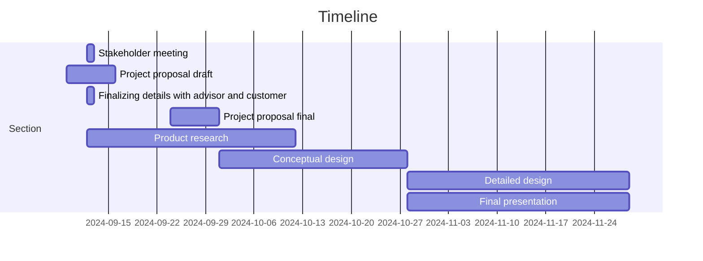

# Tennis Ball Collector

## Team 3

ECE 4961-001 

### Introduction 

Tennis is a time-honored game that can be dated back to the 11th century, played by all ages all around the world. When you think of tennis you think of the intense competition, the player’s personalities, and the feeling in the of your favorite team winning. What is not talked about however is the cleanup process, after an intense match there is a lot of preparation that goes into getting the next match ready. When consulting the customer, they explained that their current tennis ball collecting method was outdated and broken. The main objective of this Capstone Design is to make improvements to the current Tennis Ball Collector adding remote control capability and an accurate ball counter to help make the cleanup process more effective.  

### Formulating the Problem 

Collecting Tennis Balls at the end of a long day at practice is a daunting task for players who have been running for hours on end. Having to go and pick up each ball one by one is not only a waste of the players' time, but energy as well. To aid in this task, companies have created push devices that collect balls into a cart. While these devices provided a solution to the bigger problem, they raised concerns for more. After taking in many tennis balls, these machines can jam, halting the process. Along with that, these devices can move for their given purpose but cannot be easily transported from court to court. With teams having indoor and outdoor courts at different locations this is crucial. Having to push a cart around a big court after already being tired out from practice is very undeseriable however making the collector remote control turns it into a fun task after a long practice.  

### Specifications and Constraints

Specifications

1. The improved version of the tennis ball collector shall not be autonomous but will have improved features such as a sensor indicating the number of balls that go into the collector.

2. Any modifications to the tennis ball collector shall not impact its pre-existing performance of collecting and managing 50-100 balls at a time on indoor and outdoor courts.

3. Any modifications to the tennis ball collector shall not pose damage or injury risk to individuals, operators or property.

4. The improved version of the tennis ball collector shall be easy to carry for a single person with two hands including modifications.  

5. The improved version of the tennis ball collector shall be cost-efficient with costs no more than 33% more than the customer’s alternative option, Playmate’s ball mower valued at $695.

Constraints

1. If the design uses lithium ion batteries for powering the circuitry within the tennis ball collector, the batteries and its casing shall comply with 49 CFR 173.185 to prevent short-circuits,damage caused by the shifting of components within a device, and accidental activation of equipment. 

2. If using alkaline or dry cell batteries in the design, the modifications shall comply with the U.S. Hazardous Materials Regulations for dry cell batteries.
   
3. If the sensors implemented in the tennis ball collector operate at a radio frequency greater than 9kHz, the device shall comply with FCC part 15 under the classification of an unintentional radiator.

### Survey of Solutions 

On the market, there is a robotic tennis ball collector that collects balls on clay courts, on the entire court including the net, fence, and corners, and it weighs approximately 25 lbs. Yet not everyone can attain one unless they have roughly $3,000 to afford it. Tennis is already an expensive sport that should not require additional spending to pick up tennis balls. There are other manual tennis ball collectors, like the machine the Tennessee Tech Tennis team is using. The issue, as previously stated, is limited to the kind of court, the number of tennis balls it can collect, and the weight of the big tennis ball mower. Also, depending on which manual mower, the price can vary, and our school cannot even purchase a recent mower.  

 
### Unknown obstacles 

The process of customizing computer chips for design and having the hardware behave functionally as expected. 

Response of the sensors of the counter to ensure foreign objects aren't counted. 

Potential damage to hardware applied to vehicle from differing weather conditions including but not limited to heavy rainfall, snow, and thunderstorms. 

Response of Software and Hardware to electromagnetic interference brought by other devices or external sources. 

### Measure of Success 

The project shall build upon the already established tennis ball collector used by Tennessee Tech. The project shall enhance the ball collector by making it remote controlled, adding a counter to ensure complete collection of balls, add a vibrating function to eliminate blockage, and add hinges to help with the mobility on different terrain. With consecutive testing of these 4 designs, the project shall be deemed successful by: Fully controllable with a remote, Compact effectiveness and mobility, the customer shall test the mobility by having the project being used during practice. Eliminating blockage, the customer shall test the vibrating function with actual tennis balls to see its effectiveness. Finally for adding a counter having different sensors to detect the difference of the balls and foreign objects shall provide effective results.

### Broader Implications/Ethics 
This project will act as a means of improving the current tennis team’s training efficiency, device accessibility, and facility maintenance. Globally, considering the demand for this product, it could contribute to resource depletion. Economically, this product could save TN Tech funding as we are modifying the existing model instead of purchasing a new one. From an environmental perspective, the process of designing our product could contribute to global waste and energy consumption. Socially, this product could create disparities between well-funded sports facilities and underprivileged communities. We are adament to developing a solution that is within health and safety regulations,  mindful of resource usage.  

### Resources 
To make a cost-effective, portable, remote controlled tennis ball collector efficient, it will take a solid understanding of remote controls and RF and knowledge of parts necessary for the robot. A processor that can handle multiple sensors such as infrared is needed for this robot. Lab equipment such as oscilloscopes and computers to interface with the processor will be needed. It is expected that it will take $1,000 dollars for prototyping to get the desired results. This number comes from the cost of all components mentioned above plus some extra because components may become damaged while working with them. This number comes from the cost of some components being added together with a small amount of overhead. Some of the more expensive components are the battery and charger which will range somewhere between $100-200 for a lithium-ion battery with high capacity, a raspberry-pi 5 is $80 dollars and we will also need a case and cables for it, and other various sensors together will cost around $200 dollars. This number will not be passed due to the individual components being used for prototyping being inexpensive for the most part. On top of prototyping costs, funding will be needed for CAD softwares and creating the finished build which will add at least $500 dollars based on softwares currently on the market so $1,500 will be enough to meet the customer’s needs.
 

### Personnel 

Carter Brady- Has worked with autonomous vehicle simulations including ROS. Has strong software background. 

Gabriel Dubose- Experience in working microcomputer processing, digital systems, Arduino coding  

Cindy Escobar- Experienced with object-oriented programming, a little RANCS autonomous vehicle programming, microcomputing, and digital systems. 

Tate Finley- Experienced with C/C++, Schematic design, and interest in recursive neural networks.  

Ashli Watkins- Previous work in object-oriented programming, computer networking, and circuit design/wiring 

Maxwell Wynne- Has experience with languages C/C++, python, and assembly. Also has experience with microcomputing and algorithms. 

 

### Timeline 

Initial meeting with stakeholder 09/12, declaring the first set of draft specifications 

Project Proposal Draft expected to be completed by September 16th 

Finalizing details with advisors and customers for proposal 

Project Proposal Final expected to be completed by September 30th 

Researching components that can be used for the design. 

Conceptual Design expected to be completed by October 28th 

Verifying theories of implementation of software and design with advisor and customer. 

Detailed Design expected to be completed by November 30th 

Final Presentation expected to be completed by November 30th 

The project will be done with the project by May 25th, 2025 

### Contributions 

Carter Brady – Worked on resources, personnel, and timeline 

Maxwell Wynne – Worked on formulating the problem, personnel, and timeline 

Gabriel Dubose - Worked on Introduction, personnel, and timeline 

Tate Finley – Worked on sections ‘summarizing the problem,’ and ‘looking down the path to success’ including subsections. 

Ashli Watkins- Specification and Contributions, Timeline 

Cindy Escobar- Survey of Solutions, Personnel, Timeline 

 ### References

 [1] “Ball Mower 2.0,” PLAYMATE Tennis, https://www.playmatetennis.com/ball-mower-2/ (accessed Oct. 7,             2024). 
[2] “Tennibot ,” Tennibot, https://www.tennibot.com/buy/ (accessed Oct. 7, 2024). 
